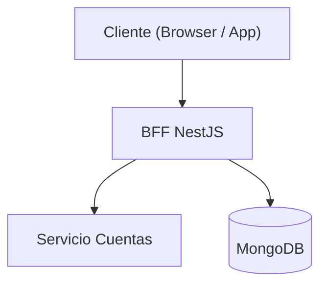
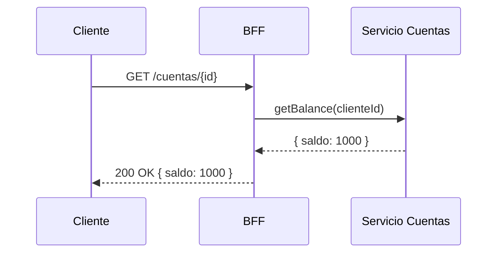
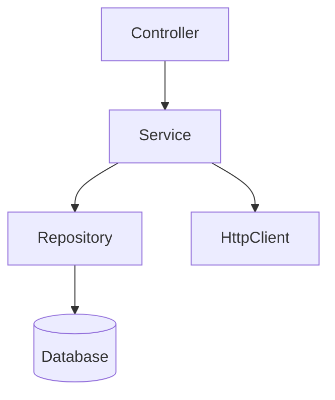

# Diagramas Mermaid en repositorios destino

## Objetivo

Generar y mantener diagramas Mermaid actualizados en el repositorio destino: arquitectura
del sistema, flujos de secuencia y árbol de dependencias entre módulos. Los diagramas
viven en el repositorio destino (en README.md o en `docs/`).

## Cuándo activar

- Se pide generar o actualizar un diagrama de arquitectura, secuencia o dependencias.
- Un developer finalizó una feature que impacta en la arquitectura o los flujos del módulo.
- Se detecta un diagrama ausente en un módulo que lo requiere (ver "Auditoría").
- Se modifica una interfaz pública, un endpoint, o una integración entre módulos.

## Cuándo NO activar

- Cambios internos de implementación sin impacto en la arquitectura visible.
- Documentación puramente textual sin diagramas → usar `common-repo-documentation`.
- Documentación inline en código → usar el skill de doc del stack.

## Tipos de diagrama y cuándo usarlos

### Diagrama de arquitectura (`flowchart TD`)

Muestra los componentes principales del sistema y sus relaciones estáticas.



Generar cuando hay múltiples módulos, servicios o integraciones externas.
Ubicar en el `README.md` del root o de la carpeta del módulo principal.

### Diagrama de secuencia (`sequenceDiagram`)

Muestra el flujo temporal de una operación o caso de uso con sus participantes.



Generar cuando hay flujos de negocio con más de 2 participantes, llamadas externas o
lógica de error relevante. Ubicar en el README.md del módulo o en `docs/flujos/<nombre>.md`.

### Árbol de dependencias (`graph TD`)

Muestra las dependencias entre módulos, paquetes o capas del sistema.



Generar cuando hay capas bien definidas o módulos con dependencias no obvias.
Ubicar en el README.md del módulo o en `docs/arquitectura.md`.

### Ubicación por defecto cuando el paquete usa `docs/`

Si el paquete/repo ya sigue la convención de `docs/` (por ejemplo porque tiene
`docs/testing.md`), los diagramas de arquitectura y secuencia van por defecto en
`docs/arquitectura.md`, y el README correspondiente (raíz o de la subcarpeta) los
referencia con un link corto en lugar de embeberlos completos. Esto evita READMEs
largos y mantiene un único lugar de verdad para los diagramas. Si el paquete no usa
`docs/`, seguí usando la regla general (README del módulo).

### Un archivo por diagrama + índice, cuando hay más de uno

Cuando un módulo termina teniendo **más de un diagrama** (ej. arquitectura + uno o más
de secuencia + árbol de dependencias), cada diagrama vive en su propio archivo dentro de
`docs/diagramas/<nombre-descriptivo>.md`. El nombre describe el **tipo** de diagrama y,
si aplica, el flujo/variante que representa (ej. `componentes.md`,
`secuencia-<nombre-del-flujo>.md`, `dependencias.md`) — siempre genérico según el tipo de
diagrama, nunca acoplado a nomenclatura de negocio específica de un repo puntual.

El archivo agregador (`docs/arquitectura.md` si el paquete usa `docs/`, o la sección
correspondiente del README si no) deja de embeber los diagramas completos y pasa a ser un
**índice**: una tabla con un link a cada archivo de diagrama y una descripción de una
línea de qué muestra. Cada archivo de diagrama individual linkea de vuelta al índice (y,
si corresponde, a diagramas hermanos relacionados, ej. distintos flujos/modos del mismo
tipo de diagrama).

Aplicá esta separación solo cuando haya **más de un diagrama** para el mismo módulo; si
hay uno solo, seguí embebiéndolo directo en el README o en `docs/arquitectura.md` sin
crear la carpeta `diagramas/` ni el índice.

## Descubrimiento de estructura y dependencias (antes de generar diagramas)

Los diagramas de arquitectura, secuencia y dependencias se construyen a partir de una
exploración real del código, nunca de suposiciones. Proceso genérico, aplicable a
cualquier repo/stack:

1. **Identificar los dominios**: las carpetas de nivel 1 dentro de `src/` (o equivalente
   del stack) — los mismos límites que usa `common-repo-documentation` para decidir qué
   amerita README propio. Estos son los nodos candidatos de un diagrama de dependencias
   o de componentes.
2. **Verificar imports reales entre dominios**: para cada dominio, buscar (grep/lectura)
   sus imports hacia otros dominios internos y hacia paquetes externos (librerías,
   paquetes de un monorepo, servicios). Un edge en el diagrama solo se agrega si hay al
   menos un import verificado que lo sustente.
3. **No agregar nodos ni edges especulativos**: si un dominio no importa nada de otro,
   no hay flecha entre ellos, aunque "tenga sentido" que la hubiera. Si el descubrimiento
   confirma la **ausencia** de una dependencia esperable (ej. un módulo que
   deliberadamente no depende de otro), vale la pena anotarlo como nota debajo del
   diagrama en vez de forzar un edge.
4. **Para diagramas de secuencia**: recorrer el código real del flujo (funciones
   invocadas, requests HTTP/RPC, callbacks, eventos) para identificar los participantes
   y el orden real de los pasos, en vez de asumir un flujo genérico tipo
   request-response.
5. **Si hay más de un flujo/variante relevante** (distintas configuraciones, feature
   flags, entornos, modos de operación) con un orden de pasos o participantes distinto,
   generar un diagrama de secuencia por variante en vez de forzarlos en uno solo —
   siguiendo la convención de archivo por diagrama de la sección anterior.

## Reglas obligatorias (MUST / MUST NOT)

1. MUST usar sintaxis Mermaid válida dentro de bloques ` ```mermaid ``` `.
2. MUST mantener los diagramas sincronizados con el código: si cambia un endpoint,
   servicio o dependencia, el diagrama afectado se actualiza en el mismo PR.
3. MUST ubicar los diagramas cerca del código que documentan: en el `README.md` del
   módulo o en `docs/` si hay más de un diagrama complejo por módulo.
4. MUST usar nombres en el diagrama que coincidan con los nombres reales del código
   (nombres de clases, servicios, endpoints, paquetes).
5. MUST construir cada nodo/edge de un diagrama de arquitectura o dependencias a partir
   de imports/llamadas verificadas en el código real (ver "Descubrimiento de estructura
   y dependencias") — nunca asumidas por analogía o por cómo "debería" ser.
6. MUST separar cada diagrama en su propio archivo dentro de `docs/diagramas/` cuando el
   módulo tenga más de uno, con un índice que los enlace (ver sección correspondiente).
7. MUST NOT inventar componentes que no existen en el repo — solo documentar lo real.
8. MUST NOT dejar diagramas con placeholders vacíos sin completar.
9. MUST NOT duplicar el mismo diagrama en múltiples lugares; usar referencias si es necesario.

## Recomendaciones (SHOULD)

- SHOULD generar al menos un diagrama de arquitectura por módulo principal con más de
  2 colaboradores o integraciones externas.
- SHOULD agregar diagramas de secuencia para flujos con más de 2 participantes.
- SHOULD usar árbol de dependencias cuando las relaciones entre capas no son evidentes.
- SHOULD mantener los diagramas simples: si superan 15 nodos, dividir en sub-diagramas
  y moverlos a `docs/`.

## Auditoría de diagramas faltantes

Cuando se pide auditar los diagramas del repo destino:

1. Recorrer los módulos o paquetes principales de `src/` (o equivalente del stack).
2. Para cada módulo con más de 2 colaboradores o integraciones externas, verificar si
   existe al menos un diagrama de arquitectura.
3. Para cada endpoint o flujo de integración externa, verificar si hay diagrama de secuencia.
4. Reportar por módulo: **AUSENTE** | **DESACTUALIZADO** (no refleja la estructura actual) | **OK**.

## Checklist antes de entregar

- [ ] Diagramas en Mermaid válido (no pseudocódigo ni ASCII art).
- [ ] Nombres en el diagrama coinciden con el código real.
- [ ] Diagramas ubicados cerca del módulo que documentan.
- [ ] No quedan placeholders sin completar.
- [ ] Diagramas existentes actualizados si se modificó arquitectura o flujos.
- [ ] Cada edge/nodo de arquitectura o dependencias está respaldado por un import o
      llamada verificada en el código, no asumido.
- [ ] Si hay más de un diagrama para el módulo: cada uno vive en su propio archivo bajo
      `docs/diagramas/` y existe un índice (tabla con links y descripción) que los agrupa.

## Conexiones con otros skills

- `common-repo-documentation` — los diagramas se incluyen dentro de los READMEs generados.
- `nodejs-code-documentation-jsdoc` / `frontend-code-documentation-tsdoc` / `dotnet-code-documentation-xmldoc` / `java-code-documentation-javadoc` — complementan con documentación inline en código.
