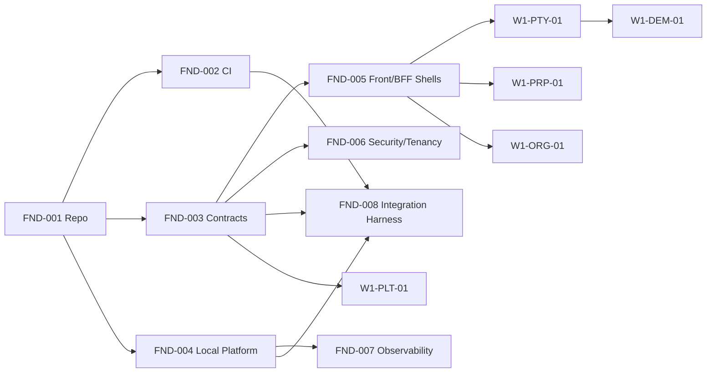

# CRM Inmobiliarias — Arquitectura de Software V1

> **Fuente de dominio:** [`README.md`](README.md)  
> **Backlog trazable:** [`docs/tasks/TASK_BOARD.md`](docs/tasks/TASK_BOARD.md)  
> **Mercado inicial:** Argentina  
> **Objetivo:** convertir el modelo de dominio en una arquitectura implementable y verificar que cada caso de uso tenga recorrido completo desde UX hasta persistencia, eventos y lectura.

## 1. Regla de validación arquitectónica

La arquitectura se considera válida únicamente si cada caso de uso puede recorrerse de extremo a extremo:

```text
Actor
  -> Journey / Frontend
  -> BFF
  -> API / Command / Query
  -> Servicio propietario
  -> Aggregate / Entidad
  -> Persistencia
  -> Evento, si corresponde
  -> Consumidores / Proyecciones
  -> Read Model
  -> Feedback al usuario
```

Ninguna entidad existe solo para completar un diagrama y ningún microservicio existe únicamente para envolver una colección. Si un caso de uso no puede mapearse sin ambigüedad, el diseño debe revisarse.

## 2. Arquitectura aplicada

La arquitectura lógica utiliza:

- **Domain-Driven Design (DDD):** bounded contexts y lenguaje ubicuo como límites semánticos.
- **Microservicios por capacidad de negocio:** no se crea un servicio por entidad.
- **Arquitectura hexagonal / Ports & Adapters:** dominio y aplicación no dependen de MongoDB, RabbitMQ, Keycloak ni proveedores externos.
- **Event-Driven Architecture:** eventos de integración versionados para desacoplar procesos.
- **Transactional Outbox / Inbox:** publicación confiable e idempotencia de consumidores.
- **CQRS selectivo:** writes en el servicio propietario; read models para vistas 360, dashboards y consultas compuestas.
- **BFF por experiencia:** las APIs de experiencia siguen journeys y no exponen la topología interna de servicios.
- **Ownership de datos por servicio:** una colección pertenece a un único servicio; ningún otro servicio accede a ella directamente.
- **Multi-tenancy lógico:** `tenantId` en todos los datos de negocio y autorización por tenant/scope.

La arquitectura lógica está preparada para distribución, pero la POC evita complejidad operativa innecesaria.

## 3. Principio de producto que condiciona la arquitectura

> **El modelo rico define lo que el sistema puede representar; no lo que el usuario está obligado a cargar.**

Se distinguen tres niveles de datos:

1. **Mínimo operativo:** permite avanzar con el caso de uso.
2. **Enriquecimiento recomendado:** mejora matching, analytics, automatización o experiencia.
3. **Requerido por acción concreta:** solo bloquea cuando una invariante, integración, política o norma realmente lo exige.

Consecuencias:

- quick capture primero;
- progressive disclosure en formularios;
- `UNKNOWN` es distinto de `false`, `0` o colección vacía confirmada;
- completitud es una proyección, no una barrera universal;
- IA y conectores intentan enriquecer antes de pedir carga manual;
- una inmobiliaria pequeña puede operar con información escueta sin quedar inutilizada.

## 4. Experiencias frontend

### `crm-web`

Usuarios: agentes, gerentes, directores, administración y administradores del tenant.

Responsabilidades:

- workbench diario;
- Parties y vistas 360;
- propiedades y captaciones;
- Requirements y matching;
- visitas y agenda;
- negociación, reservas y operaciones;
- administración de alquileres;
- dashboards operativos;
- configuración permitida al tenant.

**Regla:** no es un CRUD del modelo de dominio. La UI se diseña por tareas/journeys.

### `platform-admin-web`

Usuarios: equipo interno de producto/plataforma.

Responsabilidades:

- crear/versionar/deprecar packs;
- administrar capabilities y feature flags;
- catálogos base;
- workflows y checklists estándar;
- requisitos documentales/compliance;
- políticas default de comisión;
- Automation Policies iniciales;
- definiciones de métricas;
- conectores disponibles;
- Extension Schemas versionados;
- auditoría y correcciones administrativas mediante comandos explícitos.

**No puede:**

- redefinir arbitrariamente entidades core;
- alterar invariantes del dominio;
- editar MongoDB directamente.

Un cambio en la semántica de `Party`, `Property`, `Transaction` o cualquier aggregate core requiere cambio de software/migración explícita.

### Diferido

- `crm-mobile`;
- portal de propietarios;
- portal de inquilinos;
- canal público propio;
- telefonía integrada.

Los contratos se diseñan para permitir incorporarlos después sin alterar el dominio.

## 5. BFFs

### `operations-bff`

BFF del CRM operativo. Compone APIs/read models orientados al journey del usuario.

### `platform-admin-bff`

BFF del backoffice de plataforma. Expone únicamente capacidades administrativas y auditables.

Reglas:

- .NET 10 / ASP.NET Core;
- no contiene lógica de negocio que pertenezca a aggregates;
- no accede a colecciones MongoDB directamente;
- puede componer respuestas de múltiples servicios;
- aplica autorización de experiencia además de la autorización propia de cada servicio.

## 6. Microservicios de dominio

| Servicio | Responsabilidad principal |
|---|---|
| `access-service` | Organización, sucursales/equipos, memberships, roles, scopes, overrides y reasignación de cartera. |
| `party-service` | Registro canónico de personas humanas, jurídicas y estructuras jurídicas, contactos, identificadores y relaciones. |
| `identity-resolution-service` | Detección y resolución reversible de duplicados de Party mediante evidencia y scoring. |
| `documents-compliance-service` | Documentos, requisitos contextuales, compliance, beneficiario final, consentimiento y privacidad. |
| `platform-config-service` | Packs, capabilities, catálogos, Extension Schemas y configuración versionada de plataforma. |
| `property-service` | Registro físico, geográfico, rural, registral y relacional de inmuebles, jerarquías e intereses/derechos. |
| `supply-service` | Captación, tasación, mandato de comercialización, Listings y términos comerciales. |
| `syndication-service` | Proyección y sincronización de Listings con portales/canales externos. |
| `interaction-service` | Conversaciones e interacciones omnicanal, media y vínculos con casos comerciales. |
| `demand-service` | Inquiry y Requirement, criterios, importancia, confianza y proveniencia. |
| `matching-service` | Generación de candidatos, scoring explicable, feedback e invalidación de matches. |
| `scheduling-service` | Agenda, disponibilidad y adapters de Google/Outlook. |
| `commercial-service` | Visitas, negociación, propuestas y contraofertas. |
| `closing-service` | Reserva/seña, Transaction, workflow, tareas, aprobaciones y excepciones hasta cierre. |
| `commission-service` | Políticas versionadas de honorarios, splits e incentivos y su cálculo. |
| `rental-service` | Administración económica de alquileres: cronogramas, cuentas a cobrar, pagos, mora, gastos y liquidaciones. |
| `maintenance-service` | Módulo opcional de reclamos, presupuestos y órdenes de trabajo. |
| `automation-ai-service` | Políticas event-driven, subagentes, autonomy modes, confidence, approvals y auditoría de decisiones. |
| `notification-service` | Notificaciones internas y recordatorios externos multicanal. |
| `analytics-copilot-service` | Read models, dashboards, lineage y consultas conversacionales autorizadas. |

### Servicios técnicos

- `asset-service`: abstracción para archivos/binarios; POC con filesystem local mediante `IObjectStorage`.
- `audit-service`: auditoría append-only de acciones sensibles.
- búsqueda dedicada: **diferida**. V1 usa índices y consultas MongoDB detrás de puertos.

## 7. Persistencia MongoDB

### Una instancia, ownership lógico

La POC utiliza una única instancia MongoDB Community. Esto no autoriza acceso cruzado entre servicios.

Ejemplo conceptual:

```text
MongoDB
├── access_*
├── party_*
├── identity_*
├── property_*
├── supply_*
├── demand_*
├── matching_*
├── commercial_*
├── closing_*
├── rental_*
└── analytics_*
```

Cada colección tiene un único owner.

### Colección por raíz de agregado

No significa una colección por clase. Significa que la unidad de consistencia del dominio guía el documento MongoDB.

Ejemplo:

```text
Requirement (aggregate root)
└── criteria[]
```

Los criterios pueden embebirse si su ciclo de vida y consistencia dependen del Requirement y el tamaño permanece acotado.

En cambio:

```text
Property A
Property B
Property C
```

son aggregates independientes aunque formen parte de un mismo edificio/campo. Se relacionan por IDs para evitar documentos gigantes y permitir concurrencia independiente.

### Regla embed vs reference

Embebido cuando:

- forma parte de la misma invariante;
- no necesita ciclo de vida independiente;
- volumen acotado;
- se lee/escribe habitualmente junto.

Referencia cuando:

- tiene ciclo de vida propio;
- puede crecer sin límite razonable;
- necesita concurrencia independiente;
- otro aggregate lo referencia;
- tiene ownership o permisos diferentes.

## 8. Event-Driven Architecture

Broker POC: **RabbitMQ Community**.

Cada evento público debe declarar:

```text
eventId
name
version
occurredAt
tenantId
actor
correlationId
causationId
aggregateId
payload
```

Reglas:

- Outbox en el mismo boundary de persistencia que el cambio de negocio;
- consumers idempotentes mediante Inbox/messageId;
- delivery al menos una vez asumida;
- DLQ para mensajes no procesables;
- eventos públicos son hechos ocurridos, no comandos disfrazados;
- payload mínimo: no replicar aggregates completos ni PII innecesaria;
- cambios incompatibles requieren nueva versión.

Ejemplo:

```text
PartyRegistered
  -> identity-resolution-service revisa candidatos
  -> analytics-copilot-service actualiza proyecciones
```

El evento existe para evitar que `party-service` conozca o invoque directamente esos procesos secundarios.

## 9. CQRS y read models

Se utiliza selectivamente.

Writes:

- comandos al servicio propietario;
- validación de invariantes;
- consistencia local del aggregate.

Reads compuestos:

- `Party360`;
- `Property360`;
- `AgentToday`;
- `ManagerCockpit`;
- `ListingPerformance`;
- métricas de alquileres;
- vistas del copiloto.

Los read models son derivados y reconstruibles. No son fuente de verdad ni reciben comandos de negocio.

## 10. Seguridad y tenancy

- Keycloak Community vía OIDC/OAuth2.
- Un realm de plataforma es suficiente para la POC.
- `tenantId` no se confía desde un body enviado por el cliente; se deriva del contexto autenticado/autorizado.
- RBAC + scope organizacional + overrides explícitos.
- agentes ven su propia cartera por default;
- gerencias ven su scope organizacional;
- dirección puede recibir scope global;
- excepciones quedan auditadas y pueden vencer.
- cada servicio vuelve a validar autorización; el BFF no es la única barrera.

## 11. IA y automatización

La IA nunca accede directamente a MongoDB.

Opera mediante:

- APIs;
- commands;
- queries/read models autorizados;
- eventos;
- tools declaradas.

Modos de autonomía:

```text
SUGGEST_ONLY
REQUIRE_APPROVAL
AUTO_EXECUTE_WITH_GUARDRAILS
AUTO_EXECUTE
```

Toda decisión relevante guarda:

- actor/modelo;
- versión;
- confidence;
- evidencia/provenance;
- acción propuesta/ejecutada;
- resultado;
- correlationId.

## 12. Backoffice de plataforma

Es una aplicación distinta del CRM operativo.

Casos principales:

- publicar/versionar packs argentinos;
- habilitar/deshabilitar capabilities;
- administrar catálogos;
- versionar workflows/checklists;
- versionar requisitos documentales;
- definir policies default de comisiones;
- definir Automation Policies starter;
- administrar conectores y flags;
- publicar Extension Schemas;
- previsualizar impacto de una versión;
- habilitar pilotos;
- promover configuración entre ambientes;
- auditar cambios;
- ejecutar correcciones administrativas autorizadas mediante comandos del servicio owner.

## 13. Stack POC

| Capa | Decisión |
|---|---|
| CRM Web | React + Next.js + TypeScript |
| Platform Admin Web | React + Next.js + TypeScript |
| BFFs | .NET 10 + ASP.NET Core |
| Backend | .NET 10 + ASP.NET Core |
| Persistencia | MongoDB Community |
| Mensajería | RabbitMQ Community |
| Identidad | Keycloak Community / OIDC |
| Caché | `IMemoryCache` inicialmente |
| Search/geo | MongoDB nativo (`$text`, índices, `2dsphere`) |
| Binarios | filesystem local detrás de `IObjectStorage` |
| Observabilidad | OpenTelemetry + logs estructurados |
| Analytics | proyecciones MongoDB; sin warehouse |
| Infra local/demo | Docker Compose |
| Mobile | diferido |
| Telefonía | diferida |
| Kubernetes/OpenShift | diferido |
| Redis/Valkey | diferido hasta necesidad medida |
| OpenSearch | diferido hasta necesidad medida |

## 14. Frontend: principios UX obligatorios

- task/journey driven, no entity CRUD driven;
- quick capture;
- progressive disclosure;
- defaults argentinos;
- acciones primarias visibles y lenguaje de negocio;
- complejidad avanzada aparece solo cuando hace falta;
- mostrar el beneficio de completar información, no castigar al usuario por no hacerlo;
- autosave donde sea seguro;
- no pedir el mismo dato dos veces si puede derivarse o reutilizarse;
- toda sugerencia IA debe poder explicarse;
- errores deben indicar qué acción concreta resuelve el problema.

## 15. Trazabilidad de casos de uso

El catálogo operativo está dividido en **92 work packages** que cubren **274/274 casos de uso**.

Ver [`docs/tasks/TASK_BOARD.md`](docs/tasks/TASK_BOARD.md).

Cada task debe declarar:

- UCs incluidos;
- actor;
- journey/superficie;
- BFF;
- servicios;
- aggregates/entidades;
- eventos;
- dependencias;
- datos mínimos;
- permisos;
- criterios de aceptación;
- tests;
- write zones.

Una task no puede cerrarse si un UC carece de alguno de esos vínculos cuando aplica.

## 16. Orden de implementación



Primero se estabilizan contratos y guardrails; después se paralelizan vertical slices.

## 17. Regla para agentes de IA

La unidad de asignación es una **task/work package**, no un microservicio completo ni una ola completa.

El agente debe recibir solo:

1. la task;
2. las secciones de dominio relevantes del README;
3. esta arquitectura;
4. contratos que consume/publica;
5. skills aplicables.

No debe leer 8.000 líneas de documentación por defecto.

`PRPs/` es el mecanismo de ejecución de una task tomada. `docs/tasks/` es el backlog maestro. No convertir las 92 tasks en 92 PRPs simultáneamente.

## 18. Cambios que requieren ADR

Abrir un ADR antes de cambiar:

- ownership de aggregate/colección;
- límites de microservicio;
- datastore principal;
- estrategia de consistencia cross-service;
- contrato público incompatible;
- semántica de evento público;
- invariante core;
- política global de tenancy/autorización.

## 19. Definition of Done arquitectónica

Antes de marcar una task como terminada:

- [ ] UCs cubiertos;
- [ ] journeys implementados o explícitamente diferidos;
- [ ] servicio owner correcto;
- [ ] invariantes testeadas;
- [ ] tenant/authorization testeado;
- [ ] eventos y contratos versionados;
- [ ] Outbox/Inbox donde corresponde;
- [ ] read models actualizados;
- [ ] observabilidad básica;
- [ ] documentación sincronizada;
- [ ] ningún acceso a colección ajena;
- [ ] ningún dato opcional convertido artificialmente en obligatorio;
- [ ] ningún cambio fuera del scope de la task.

## 20. Próxima documentación funcional

Después de estabilizar dominio + arquitectura se debe crear un documento funcional por journey/caso de uso con:

- objetivo de negocio;
- persona;
- precondiciones;
- happy path;
- variantes;
- errores;
- información mínima/recomendada/obligatoria;
- copy/UX esperado;
- permisos;
- acceptance criteria;
- métricas de éxito.

Ese catálogo será la entrada directa para diseño UI/UX y prototipos.
