# CRM Inmobiliarias — Modelo de Dominio V1

> **Estado:** Draft de arquitectura de dominio para iteración  
> **Mercado inicial:** Argentina  
> **Persistencia de referencia:** MongoDB  
> **Intención arquitectónica:** bounded contexts desacoplados, preparados para desplegarse como microservicios sin rediseñar el dominio  
> **Fecha:** 2026-08-29  
> **North Star:** aumentar las operaciones cerradas por agente activo sin aumentar su carga administrativa.

---

## 0\. Resumen ejecutivo

Este documento define el **modelo de dominio V1** para un CRM inmobiliario argentino diseñado bajo cinco premisas:

1.  **Ultra simple para operar.** El usuario común no debería necesitar comprender el modelo de dominio ni configurar decenas de cosas para comenzar.
2.  **Complejo por debajo.** El sistema debe poder soportar excepciones, estructuras jurídicas complejas, operación rural, múltiples monedas, negociación, administración de alquileres, IA, omnicanalidad y auditoría.
3.  **Opinionated by default, extensible by exception.** Argentina tendrá packs precargados de workflows, documentación, compliance, taxonomías y reglas habituales; una organización podrá extenderlos sin transformar el producto en un constructor genérico de CRM.
4.  **Domain-first y distribuible.** Ningún bounded context accede directamente a las colecciones internas de otro. La integración ocurre mediante contratos, comandos, queries explícitas, eventos y read models.
5.  **La actividad real alimenta al CRM.** WhatsApp, email, Instagram, Facebook, portales, app móvil, llamadas, audios, visitas y notas deben transformarse automáticamente en información útil del dominio, reduciendo al mínimo la carga manual del agente.

El producto no se modela copiando objetos tradicionales de Salesforce. En particular:

- **No existe `Lead` como entidad permanente.**
- Cada contacto produce una `Interaction`.
- Una intención comercial no clasificada puede producir una `Inquiry`.
- Una necesidad de demanda se modela como `Requirement`.
- Una oportunidad de captar un inmueble se modela como `CaptationCase`.
- Una persona/empresa/estructura jurídica se representa una sola vez como `Party`, independientemente de los roles que cumpla.
- Un inmueble físico (`Property`) no es una publicación comercial (`Listing`).
- Una negociación no es una nota: tiene propuestas, contrapropuestas, participantes, términos e historia.
- La reserva es independiente de la oferta aceptada y de la operación final.
- La administración de alquileres mantiene un **ledger operativo**, pero no intenta reemplazar un ERP contable.

---

# 1\. Principios de producto y dominio

## 1.1 Simple by default, powerful by exception

Una inmobiliaria debería poder:

1.  crear la organización;
2.  indicar sucursales/equipos;
3.  invitar agentes;
4.  elegir los módulos que usa;
5.  conectar canales;
6.  empezar a operar.

No debería configurar desde cero:

- etapas básicas de una compraventa;
- documentación argentina habitual;
- estados de visitas;
- motivos de descarte;
- tipos de propiedades;
- roles organizacionales básicos;
- recordatorios razonables;
- checklist de cierre;
- políticas base de comisiones;
- reglas elementales de compliance.

Todo eso debe venir mediante **packs versionados**.

La excepción aparece solo cuando la inmobiliaria necesita algo especial.

---

## 1.2 Ubiquitous Language primero

Las palabras del sistema deben corresponder al negocio.

No usar:

- `Lead` para cualquier contacto.
- `Opportunity` como contenedor genérico de todo.
- `Customer` para una persona que hoy vende, mañana compra y pasado mañana garantiza a otra.
- `Property` para una publicación.
- `Status = WON` para ocultar todo el proceso de una operación inmobiliaria.

Usar conceptos concretos:

- `Party`
- `Interaction`
- `Inquiry`
- `Requirement`
- `CaptationCase`
- `Property`
- `Valuation`
- `CommercialMandate`
- `Listing`
- `Match`
- `Visit`
- `Negotiation`
- `Proposal`
- `Reservation`
- `Transaction`
- `ManagedAgreement`
- `Receivable`
- `Payment`
- `OwnerSettlement`

---

## 1.3 Separar identidad, rol y contexto

Una misma persona puede simultáneamente:

- vender un departamento;
- buscar una casa;
- alquilar un local;
- ser garante;
- representar una sociedad;
- ser beneficiario final de una estructura jurídica;
- ser copropietario de un campo.

Por lo tanto:

> **`Party` no tiene un único rol comercial permanente.**

Los roles aparecen dentro del contexto correspondiente.

Ejemplo:

```text
Party: Juan Pérez

CaptationCase C-10
  role = CONTACT / REPRESENTATIVE

Property P-77
  PropertyInterest
  role = CO_OWNER

Requirement R-92
  role = SEEKER

Negotiation N-38
  role = BUYER

Lease L-12
  role = GUARANTOR
```

---

## 1.4 Estado actual + historia significativa + auditoría

No se propone Event Sourcing integral para todo el sistema.

Se mantienen tres capas conceptuales:

1.  **Current State**  
    Documento actual del aggregate para lectura/escritura eficiente.
2.  **Meaningful Domain History**  
    Eventos de negocio importantes e inmutables.
3.  **Technical Audit Trail**  
    Quién cambió qué, cuándo, desde dónde y mediante qué actor/sistema.

Esto evita convertir cada corrección menor en un evento de dominio y, a la vez, permite reconstruir decisiones y operaciones relevantes.

---

## 1.5 No compartir persistencia entre bounded contexts

Aunque inicialmente varios servicios compartan un cluster de MongoDB:

```text
Party BC       -> party_db / collections propias
Property BC    -> property_db / collections propias
Demand BC      -> demand_db / collections propias
Matching BC    -> matching_db / collections propias
...
```

Regla:

> Un bounded context puede conocer el **ID público** de un aggregate de otro contexto, pero nunca leer directamente su colección.

No se diseñan “joins distribuidos encubiertos”.

---

# 2\. Alcance del producto

## 2.1 Mercado inicial

Argentina.

Eso significa que se proveerán defaults y packs argentinos, pero **las entidades fundamentales no asumirán que las Parties son argentinas**.

Se debe soportar:

- personas de cualquier nacionalidad;
- múltiples documentos emitidos por distintos países;
- empresas extranjeras;
- estructuras jurídicas extranjeras;
- domicilios múltiples;
- identificaciones fiscales múltiples;
- monedas múltiples;
- documentación extranjera.

---

## 2.2 Segmento organizacional

Objetivo:

- inmobiliarias de 2–5 personas;
- inmobiliarias medianas;
- inmobiliarias con múltiples sucursales;
- redes/franquicias de cientos de agentes.

No se optimiza inicialmente para una red global del tamaño completo de RE/MAX, pero el modelo no debe bloquear un crecimiento razonable.

---

## 2.3 Operaciones

No se hardcodeará el negocio como `SALE | RENT`.

Se utilizará un **catálogo versionado y extensible de tipos de operación**, provisto inicialmente por el `Argentina Real Estate Pack`.

Familias iniciales:

### Transferencia / disposición

- compraventa;
- permuta;
- cesión/transferencia de derechos cuando corresponda;
- comercialización de unidades en desarrollo/pozo;
- otras modalidades configuradas por pack.

### Uso y goce

- locación residencial;
- locación comercial;
- locación temporaria;
- locación de oficinas;
- locación industrial/logística;
- locación de cocheras/depósitos;
- arrendamiento rural.

### Producción rural

- aparcería;
- mediería;
- otras modalidades agroeconómicas configuradas por pack.

La Ley 13.246 distingue expresamente, entre otros, **arrendamiento rural** y **aparcería**, por lo que el dominio rural no se reduce a “alquiler de terreno”.

> El catálogo legal/comercial concreto debe revisarse con especialistas antes de considerarse un catálogo jurídico exhaustivo.

---

## 2.4 Módulos incluidos y opcionales

### Core

- Organización y autorización
- Party Registry
- Identity Resolution
- Property Registry
- Captación
- Tasaciones
- Listings
- Demanda / Requirements
- Matching
- Interacciones omnicanal
- Visitas
- Negociaciones
- Reservas
- Transacciones/cierres
- Gestión documental
- Compliance packs
- Comisiones/incentivos
- Automatizaciones
- Notificaciones
- Scheduling/calendarios
- Analytics
- Management Copilot

### Capability activable

- Administración de alquileres
- Mantenimiento
- Portal de propietarios
- Portal de inquilinos
- Telefonía integrada
- IA con mayor autonomía
- Sindicación avanzada a portales

### Fuera del alcance inicial

- contabilidad general;
- libro diario / balances;
- liquidación impositiva integral;
- campañas masivas de marketing;
- plataforma propia de firma electrónica/digital;
- ERP generalista;
- constructor BPM ilimitado.

---

# 3\. Context Map V1

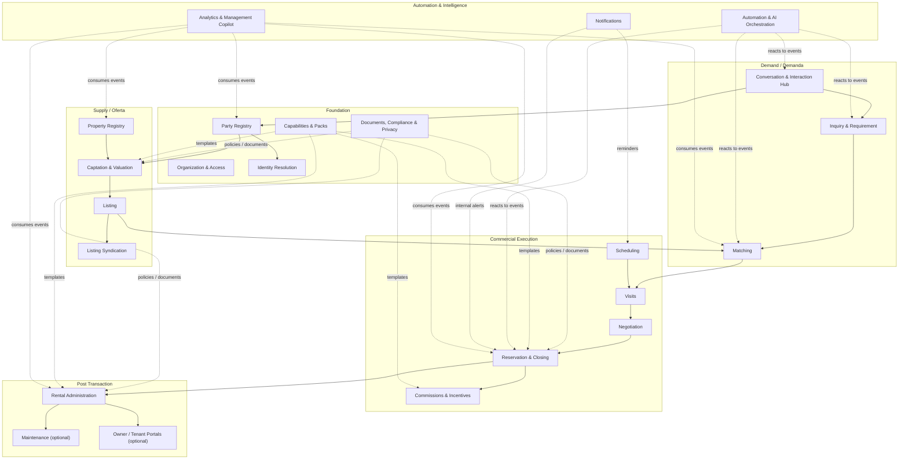

> **Importante:** bounded context no equivale automáticamente a microservicio desplegable. Son fronteras semánticas y de ownership. La agrupación física se decide luego según carga, equipo, latencia, disponibilidad y costo operativo.

---

# 4\. Fundación transversal

# 4.1 Organization & Access

## Responsabilidad

Representar la estructura de la inmobiliaria y decidir **quién puede hacer/ver qué y dentro de qué alcance**.

No debe reducirse a `role = AGENT | MANAGER`.

## Aggregate roots

### `Organization`

Representa el tenant comercial.

```text
Organization
- organizationId
- legal/display identity
- country
- defaultLocale
- defaultCurrency
- enabledCapabilities[]
- activePackVersions[]
- status
```

### `OrganizationalUnit`

Puede representar:

- sucursal;
- gerencia;
- equipo;
- unidad rural;
- unidad comercial;
- otra subdivisión.

Debe soportar jerarquía.

```text
OrganizationalUnit
- unitId
- organizationId
- parentUnitId?
- type
- name
- territory?
- specialties[]
- status
```

No se embebe todo el árbol organizacional en un único documento.

### `Membership`

Une una cuenta de usuario con una o varias unidades.

`UserAccount` representa credenciales/identidad de acceso y **no es Party**. Cuando resulte útil, una cuenta de empleado puede mantener una referencia explícita a la Party que representa a esa persona, pero ambos lifecycles siguen separados: deshabilitar un usuario no elimina a la persona del mundo real ni su historial comercial.

```text
Membership
- membershipId
- userId
- organizationId
- unitIds[]
- roleAssignments[]
- validFrom
- validTo?
```

Un agente normalmente pertenecerá a una unidad, pero el modelo soporta:

- managers con alcance múltiple;
- directores;
- personas en transición;
- equipos cross-branch;
- excepciones.

### `RoleDefinition`

Roles estándar iniciales:

- AGENT
- TEAM_LEAD
- MANAGER
- DIRECTOR
- ADMIN
- COMPLIANCE
- FINANCE/RENTAL_ADMIN

Los nombres visibles pueden configurarse.

### `PermissionGrant`

Cada permiso combina:

- acción;
- recurso;
- scope.

Scopes sugeridos:

```text
OWN
TEAM
UNIT
UNIT_AND_DESCENDANTS
ORGANIZATION
CUSTOM
```

### `UserPermissionOverride`

Permite elevar o restringir permisos sin inventar roles artificiales.

Casos:

- agente candidato a gerente;
- gerente candidato a director;
- reemplazo temporal;
- auditor;
- intervención puntual.

Debe tener:

- motivo;
- aprobador;
- vigencia;
- trazabilidad.

### `PortfolioReassignment`

Operación formal para migrar cartera/casos entre responsables.

```text
PortfolioReassignment
- fromUserId
- toUserId
- scope
- affectedEntityTypes
- criteria
- requestedBy
- approvedBy?
- executedAt
- resultSummary
```

## Defaults

- agente: ve y opera su propia cartera;
- gerente: ve unidad/gerencia;
- director: alcance organizacional;
- override: configurable y auditable.

## Invariantes

1.  Ningún permiso puede existir fuera de un `Organization`.
2.  Un override debe tener período y actor que lo otorgó.
3.  Reasignar ownership no puede destruir el historial del responsable anterior.
4.  La autorización se evalúa en backend; nunca depende solo de ocultar controles en UI.

## Eventos

- `OrganizationalUnitCreated`
- `MembershipCreated`
- `RoleAssigned`
- `PermissionOverrideGranted`
- `PermissionOverrideExpired`
- `PortfolioReassignmentRequested`
- `PortfolioReassigned`

---

# 4.2 Party Registry

## Responsabilidad

Representar a cualquier actor real o jurídico que interviene en el negocio, sin duplicarlo por rol.

## PartyKind

No alcanza con `Person | Company`.

```text
NATURAL_PERSON
LEGAL_ENTITY
LEGAL_ARRANGEMENT
```

`LEGAL_ARRANGEMENT` permite representar, según corresponda:

- fideicomisos;
- trusts extranjeros;
- otras estructuras sin forzar que sean personas jurídicas.

El catálogo puede evolucionar.

## Aggregate root: `Party`

```text
Party
- partyId
- organizationId
- kind
- lifecycleStatus
- displayName
- identityData
- contactPoints[]
- addresses[]
- taxIdentifiers[]
- identityDocuments[]
- provenance[]
- createdAt
- updatedAt
- version
```

### `NaturalPersonProfile`

```text
- givenNames
- familyNames
- preferredName
- birthDate?
- birthCountry?
- nationalities[]
- residencyCountries[]
```

### `LegalEntityProfile`

```text
- legalName
- tradeNames[]
- incorporationCountry
- legalForm?
- incorporationDate?
- registrationIdentifiers[]
```

### `LegalArrangementProfile`

```text
- arrangementType
- name
- jurisdiction
- constitutionDate?
- registrationData?
```

## Value Objects

### `ContactPoint`

```text
type = PHONE | EMAIL | WHATSAPP | SOCIAL | OTHER
value
normalizedValue
verified
preferred
source
```

### `IdentityDocument`

```text
documentType
number
issuerCountry
issuerAuthority?
issuedAt?
expiresAt?
verifiedStatus
```

### `TaxIdentifier`

```text
type
value
country
verifiedStatus
```

### `Address`

País, jurisdicción, localidad, postal, geocoding opcional, tipo y vigencia.

## `PartyRelationship`

Las relaciones no se modelan como arrays rígidos de “spouseId”.

```text
PartyRelationship
- relationshipId
- fromPartyId
- toPartyId
- relationshipType
- context?
- validFrom
- validTo?
- ownershipPercentage?
- evidenceDocumentIds[]
```

Tipos iniciales:

- SPOUSE
- PARTNER
- LEGAL_REPRESENTATIVE
- ATTORNEY_IN_FACT
- GUARANTOR
- SHAREHOLDER
- BENEFICIAL_OWNER
- TRUSTEE
- SETTLOR
- BENEFICIARY
- CO_PURCHASER
- CO_TENANT
- RELATED_ENTITY
- OTHER

El tipo es extensible mediante pack, no mediante valores libres sin semántica.

## Regla crucial

> `Party` no contiene `roles = ["BUYER", "SELLER"]`.

Esos roles existen dentro de `Transaction`, `Requirement`, `PropertyInterest`, `Lease`, etc.

## Estados

```text
PROVISIONAL
ACTIVE
ALIASED
INACTIVE
RESTRICTED
```

`ALIASED` significa que Identity Resolution determinó que esa Party corresponde a otra identidad canónica.

## Invariantes

1.  Una Party nunca se elimina destructivamente por una unificación.
2.  Los documentos de identidad conservan jurisdicción y fuente.
3.  Una Party extranjera es válida aunque la operación sea argentina.
4.  Los roles comerciales no contaminan la identidad base.
5.  Cambios de datos identificatorios producen un evento específico.

## Eventos

- `PartyRegistered`
- `PartyContactPointAdded`
- `PartyIdentityAttributesChanged`
- `PartyRelationshipCreated`
- `PartyRelationshipEnded`
- `PartyAliasedToCanonical`
- `PartyReactivated`

---

# 4.3 Identity Resolution

## Responsabilidad

Detectar que dos o más Party records probablemente representan a la misma entidad del mundo real y resolver la identidad sin bloquear el flujo de alta.

## Trigger

Se ejecuta cuando:

- se crea una Party;
- cambian **atributos relevantes para identidad**.

No se dispara por:

- notas;
- tags;
- preferencias;
- ownership comercial;
- datos no identificatorios.

Eventos de entrada:

```text
PartyRegistered
PartyIdentityAttributesChanged
```

## Aggregate root: `IdentityResolutionCase`

```text
IdentityResolutionCase
- caseId
- subjectPartyId
- candidatePartyIds[]
- status
- algorithmVersion
- scoringEvidence[]
- totalScore
- thresholdPolicyVersion
- decision
- decidedBy
- decidedAt
```

## Estados

```text
SEARCHING
SCORED
AUTO_RESOLVED
REVIEW_REQUIRED
CONFIRMED_MATCH
CONFIRMED_DISTINCT
CONFLICT
REVERSED
```

## Scoring

No usar “porcentaje de campos iguales” ingenuo.

Cada evidencia tiene:

```text
IdentityEvidence
- attributeType
- comparisonMethod
- result
- weight
- confidence
- sourceQuality
```

Ejemplos conceptuales:

- documento exacto: peso muy alto;
- CUIT exacto: muy alto;
- pasaporte + país emisor: muy alto;
- teléfono verificado: alto;
- email verificado: alto;
- nombre fuzzy: medio/bajo;
- domicilio: contextual;
- fecha de nacimiento: alto si coincide junto con otros datos.

## Thresholds

```text
score >= AUTO_MERGE_THRESHOLD
    -> resolución automática

score >= HUMAN_REVIEW_THRESHOLD
    -> bandeja de revisión

score < HUMAN_REVIEW_THRESHOLD
    -> mantener separadas
```

Los thresholds son versionados.

## No destructive merge

La unificación produce:

- canonical Party;
- aliases;
- resolución auditable;
- posibilidad de reversión.

Nunca se pierde:

- origen;
- canal;
- datos originales;
- decisión;
- algoritmo;
- score;
- aprobador.

## Posible modelo

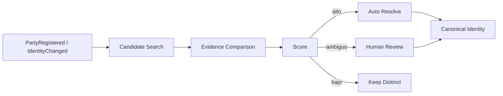

## Eventos

- `IdentityResolutionStarted`
- `IdentityCandidatesFound`
- `IdentityMatchScored`
- `IdentityReviewRequested`
- `IdentityAutoResolved`
- `IdentityMatchConfirmed`
- `IdentityDistinctConfirmed`
- `IdentityResolutionReversed`

---

# 4.4 Documents, Compliance & Privacy

Este contexto será transversal pero debe conservar ownership propio.

## `Document`

No se guarda el binario pesado dentro del aggregate de Party/Property.

```text
Document
- documentId
- organizationId
- documentType
- classification
- subjectRefs[]
- versions[]
- validationStatus
- retentionPolicy
- confidentiality
- createdBy
- createdAt
```

### `DocumentVersion`

```text
version
storageRef
hash
mimeType
size
uploadedAt
uploadedBy
source
replacesVersion?
```

## Asociación documental

Un documento puede vincularse a:

- Party
- PartyRelationship
- Property
- PropertyInterest
- Valuation
- CommercialMandate
- Listing
- Visit
- Negotiation
- Reservation
- Transaction
- ManagedAgreement
- Payment
- ComplianceCase

No se copia el archivo en cada aggregate.

## Estados de validación

```text
PENDING
VALID
REJECTED
EXPIRED
SUPERSEDED
NOT_APPLICABLE
```

## `DocumentRequirement`

Proviene de workflows/packs.

```text
- requirementCode
- appliesTo
- role
- operationType
- jurisdiction
- requiredLevel
- validityRules
- acceptedDocumentTypes[]
```

## Compliance argentino

El diseño debe permitir implementar un `Argentina UIF Pack` versionado.

La Resolución UIF 43/2024 contempla para los sujetos alcanzados, entre otras cuestiones:

- identificación y verificación del cliente;
- beneficiario final;
- comprensión del propósito de la relación;
- enfoque basado en riesgo;
- conservación de documentación;
- reconstrucción de operaciones.

La resolución exige conservar determinada documentación por no menos de diez años y que los respaldos permitan reconstruir operaciones individuales, incluidos montos y monedas cuando corresponda.

**Esto es requerimiento de diseño, no asesoramiento legal.** La configuración productiva debe validarse con Compliance/Legal.

## Aggregate: `ComplianceCase`

```text
ComplianceCase
- caseId
- subjectPartyIds[]
- transactionRef?
- activityType
- appliedPackVersion
- riskAssessment
- requiredChecks[]
- completedChecks[]
- exceptions[]
- status
```

## `BeneficialOwnershipDeclaration`

Debe poder vincular:

- estructura/entidad;
- beneficiarios finales;
- porcentaje/control cuando exista;
- base de determinación;
- documentos;
- fecha;
- validación.

## Privacy / consent

Audio, transcripciones, notas, teléfonos, emails e información inferida pueden contener datos personales.

Se modela:

### `ConsentGrant`

```text
- consentId
- partyId
- purpose
- channels
- dataCategories[]
- grantedAt
- evidence
- validUntil?
- revokedAt?
```

Casos relevantes:

- grabación de llamada;
- grabación de visita;
- transcripción;
- procesamiento con IA;
- comunicaciones.

La Ley 25.326 establece principios de consentimiento, finalidad, calidad de datos y confidencialidad; el pack de privacidad debe poder reflejar esos requisitos y excepciones aplicables.

## Eventos

- `DocumentUploaded`
- `DocumentVersionReplaced`
- `DocumentValidated`
- `DocumentRejected`
- `DocumentExpired`
- `ComplianceCaseOpened`
- `ComplianceRequirementSatisfied`
- `ComplianceExceptionRequested`
- `ComplianceCaseCompleted`
- `ConsentGranted`
- `ConsentRevoked`

---

# 4.5 Capabilities & Packs

## Objetivo

Hacer que el producto sea plug-and-play sin hardcodear en código todas las reglas argentinas.

## Principio

No construir un “mega Config Service” que entienda todo el negocio.

Cada bounded context sigue siendo dueño de su semántica.

Un `PackManifest` coordina versiones de plantillas pertenecientes a cada contexto.

## `Capability`

Ejemplos:

```text
RENTAL_ADMINISTRATION
MAINTENANCE
OWNER_PORTAL
TENANT_PORTAL
TELEPHONY
ADVANCED_AI
PORTAL_SYNDICATION
```

Estado por organización:

```text
DISABLED
ENABLED
PILOT
RESTRICTED
```

## Packs iniciales

### `Argentina Base Pack`

Incluye:

- taxonomía de propiedades;
- taxonomía inicial de operaciones;
- motivos de descarte;
- roles básicos;
- estados estándar;
- templates de tareas.

### `Argentina Compliance Pack`

Incluye:

- requisitos documentales;
- UIF;
- privacidad;
- retention policies;
- templates de controles.

### `Argentina Closing Pack`

Workflows base para:

- compraventa;
- locación;
- locación temporaria;
- operación comercial;
- operación rural.

### `Commission Pack`

Defaults editables.

### `Automation Starter Pack`

Ejemplos:

- primera respuesta;
- SLA;
- recordatorios;
- matching;
- seguimiento post visita.

## Versionado

Cada caso operacional guarda:

```text
appliedPackVersion
```

Nunca reinterpretar una operación histórica como si hubiese usado una versión nueva.

## Extensibilidad de campos

Se permiten `ExtensionSchemas` tipados para excepciones.

Evitar:

```json
{
  "customFields": {
    "cualquierCosa": "cualquierValor"
  }
}
```

Preferir:

```text
ExtensionSchema
- namespace
- entityType
- schemaVersion
- typedFields
- validationRules
```

Los atributos core siguen siendo first-class.

---

# 5\. Supply Side — Propiedades y captación

# 5.1 Property Registry

## Responsabilidad

Representar el inmueble **independientemente de que esté o no comercializado**.

## Aggregate root: `Property`

```text
Property
- propertyId
- organizationId
- propertyType
- lifecycleStatus
- parentPropertyId?
- physicalIdentity
- location
- areas
- physicalAttributes
- ruralAttributes?
- currentCondition
- occupancySnapshot?
- createdAt
- version
```

## Jerarquía

Una Property puede formar parte de otra.

Ejemplos urbanos:

```text
Desarrollo
└── Complejo
    └── Torre
        └── Piso
            ├── Unidad
            └── Cochera
```

Ejemplo rural:

```text
Campo
├── Fracción / lote productivo
├── Casco
├── Galpón
├── Silos
├── Corrales
└── Instalaciones
```

## Regla Mongo crítica

**No embebemos todo un edificio/campo en un único documento.**

Cada `Property` es aggregate independiente y referencia a su parent.

Ventajas:

- unidades con lifecycle propio;
- escrituras/listings independientes;
- no crecer sin límite;
- actualización concurrente;
- sharding futuro;
- analytics jerárquico mediante proyecciones.

## Relaciones

Además de `parentPropertyId`, pueden existir relaciones tipadas:

```text
PART_OF
ACCESSORY_TO
SERVES
SHARES_AMENITY_WITH
DERIVED_FROM_SUBDIVISION
RESULT_OF_MERGE
```

No reemplazan la jerarquía principal, la complementan.

## Tipos de propiedad iniciales

### Residencial

- casa;
- departamento;
- PH;
- dúplex/tríplex;
- vivienda en country/barrio cerrado;
- otros por pack.

### Comercial/profesional

- local;
- oficina;
- consultorio;
- edificio comercial;
- hotelería;
- otros.

### Industrial/logística

- galpón;
- depósito;
- planta;
- centro logístico;
- parque industrial / unidad.

### Tierra/desarrollo

- lote urbano;
- terreno;
- fracción;
- desarrollo;
- torre;
- unidad en desarrollo.

### Accesorios

- cochera;
- baulera;
- amarra;
- otros.

### Rural

- campo;
- estancia;
- chacra;
- quinta;
- fracción rural;
- establecimiento productivo.

Taxonomía extensible mediante pack.

## Atributos rurales first-class

El dominio rural no usa únicamente `surfaceM2`.

Ejemplos de atributos:

```text
surfaceHa
productiveSurfaceHa
soilClassification
agroEcologicalZone
productiveAptitudes[]
topography
rainfallProfile
waterSources[]
irrigation
electricity
roadAccess
distanceToPavedRoad
improvements[]
storageInfrastructure[]
livestockInfrastructure[]
agriculturalInfrastructure[]
forestryAttributes?
productionHistory?
existingUseAgreements[]
easements[]
```

No todos son obligatorios.

## `PropertyInterest`

No modelar simplemente `ownerIds[]`.

```text
PropertyInterest
- interestId
- propertyId
- holderPartyId
- rightType
- participation?
- validFrom
- validTo?
- legalBasis
- supportingDocumentIds[]
- status
```

Tipos posibles, según pack/jurisdicción:

- dominio;
- condominio;
- usufructo;
- nuda propiedad;
- derechos derivados de fideicomiso;
- otros derechos/intereses.

El modelo no presupone que siempre existe una persona humana como titular directo.

## Datos registrales / legales

```text
PropertyLegalRecord
- cadastralIdentifiers[]
- registryIdentifiers[]
- jurisdiction
- titleReferences[]
- encumbrances[]
- restrictions[]
- taxAccountIdentifiers[]
- planReferences[]
```

Los documentos completos viven en `Documents`.

## Historia significativa

Eventos que sí importan:

- cambio de titularidad;
- subdivisión;
- unificación;
- cambio registrado de superficie;
- reforma significativa;
- cambio de destino;
- cambio legal relevante;
- nueva tasación;
- gravamen/restricción.

Correcciones cosméticas quedan en audit técnico.

## Analytics jerárquico de Property

La jerarquía debe poder proyectarse en un read model como `PropertyGroupPerformance`, sin convertir al parent en dueño transaccional de todos los hijos.

Ejemplo para un edificio/desarrollo:

```text
PropertyGroupPerformance
- rootPropertyId
- descendantCount
- activeListings
- closedTransactions
- absorptionRate
- medianDaysToClose
- inquiryCount
- activeDemandCount
- averagePricePerM2
- valuationVsCloseDeviation
- captationOpportunities
```

Ejemplo rural:

```text
Campo / establecimiento
- superficie total
- superficie comercializada
- fracciones disponibles
- operaciones por modalidad
- precio/ha observado
- demanda compatible
- performance por aptitud
```

Esto permite detectar oportunidades como:

> “Las unidades de esta torre se colocan 2,3× más rápido que el promedio de la zona y tenemos demanda insatisfecha: conviene priorizar captaciones dentro del edificio.”

El dato es una **proyección analítica**, no un atributo mutable del aggregate Property.

## Eventos

- `PropertyRegistered`
- `PropertyParentChanged`
- `PropertySubdivided`
- `PropertiesMerged`
- `PropertyPhysicalAttributesChanged`
- `PropertyLegalRecordChanged`
- `PropertyInterestAdded`
- `PropertyInterestEnded`
- `PropertySignificantlyRenovated`

---

# 5.2 Captation & Valuation

## Responsabilidad

Gestionar el funnel previo a disponer de un Listing comercializable.

## Aggregate: `CaptationCase`

```text
CaptationCase
- captationCaseId
- candidatePropertyId
- contactPartyIds[]
- responsibleAssignment
- source
- status
- ownerExpectation?
- valuationRefs[]
- mandateRef?
- prioritySignals
- lossReason?
```

## Estados semánticos

```text
IDENTIFIED
CONTACTING
ENGAGED
VALUATION_PENDING
VALUATED
MANDATE_NEGOTIATION
CAPTURED
LOST
DORMANT
```

La UI puede agregar etapas específicas, pero cada etapa debe mapear a un estado semántico estándar para preservar analytics comparables.

## Captation Priority

No es un campo manual mágico.

Es una proyección calculada a partir de:

- interés del propietario;
- recencia de contacto;
- gap propietario/tasación;
- demanda compatible;
- liquidez de zona;
- potencial de comisión;
- flexibilidad de términos;
- calidad documental;
- exclusividad posible;
- capacidad del equipo;
- otros factores explicables.

Debe retornar:

```text
score
drivers[]
modelVersion
calculatedAt
```

## Aggregate: `Valuation`

Entidad formal, histórica e inmutable una vez emitida; una corrección produce nueva versión.

```text
Valuation
- valuationId
- propertyId
- requestedBy
- performedBy
- methodology
- valuationDate
- values[]
- comparableRefs[]
- assumptions[]
- marketConditions
- ownerExpectedValue?
- confidence
- validity
- documentIds[]
- version
```

### Valor

Soporta:

- total;
- por m²;
- por hectárea;
- rango;
- moneda.

### Rural

Podrá incorporar:

- aptitud;
- productividad;
- mejoras;
- rindes/producción;
- accesos;
- agua;
- infraestructura;
- comparables por hectárea;
- zonificación/agroecología.

## Aggregate: `CommercialMandate`

```text
CommercialMandate
- mandateId
- propertyId
- grantingPartyIds[]
- authorizedOperationTypes[]
- exclusivity
- validFrom
- validUntil?
- commercialConditions
- commissionTerms
- signatories[]
- supportingDocumentIds[]
- status
```

Estados:

```text
DRAFT
ACTIVE
EXPIRED
REVOKED
SUPERSEDED
```

## Invariantes

1.  Una captación no implica que el inmueble ya esté publicado.
2.  Una Valuation jamás sobrescribe otra histórica.
3.  La expectativa del propietario y la tasación profesional son conceptos distintos.
4.  Un Listing que requiera mandato debe verificar uno vigente conforme a la política aplicable.
5.  La exclusividad tiene vigencia propia.
6.  El scoring de captación debe ser explicable.

## Eventos

- `CaptationCaseOpened`
- `CaptationContacted`
- `ValuationRequested`
- `ValuationIssued`
- `OwnerExpectationChanged`
- `CommercialMandateGranted`
- `CommercialMandateExpired`
- `CaptationCaptured`
- `CaptationLost`

---

# 5.3 Listing

## Responsabilidad

Representar la **oferta comercial** de una Property bajo una modalidad y condiciones concretas.

## Aggregate root: `Listing`

```text
Listing
- listingId
- propertyId
- commercialMandateId?
- operationType
- canonicalPresentation
- commercialTerms
- availability
- occupancyContext
- responsibleAssignment
- activeFrom
- activeUntil?
- status
- version
```

## Regla esencial

```text
Property != Listing
```

Una Property puede tener:

- cero listings;
- múltiples listings históricos;
- múltiples listings concurrentes.

Ejemplo:

```text
Property P-1

Listing L-2024-SALE   -> CLOSED
Listing L-2025-RENT   -> CLOSED
Listing L-2026-SALE   -> ACTIVE mientras está alquilada
```

## Estado de Listing

Mantener simple:

```text
DRAFT
READY
ACTIVE
PAUSED
CLOSED
WITHDRAWN
EXPIRED
```

No meter `UNDER_NEGOTIATION` como estado exclusivo: puede haber múltiples negociaciones simultáneas sin que deje de estar activo.

Información comercial paralela:

```text
hasActiveNegotiations
hasReservation
occupancyStatus
```

## `CommercialTerms`

No reducir a `price + currency`.

Debe soportar:

```text
askingConsiderations[]
negotiable
financingOptions[]
installments[]
exchangeAccepted
acceptedAssets[]
indexationRules[]
paymentSchedule?
conditions[]
validity?
```

### `Consideration`

Puede ser:

```text
MONEY
PROPERTY_EXCHANGE
PERCENTAGE
PRODUCTION_SHARE
GOODS
MIXED
```

Esto permite:

- USD efectivo;
- ARS;
- financiación;
- parte en dinero + permuta;
- valor por hectárea;
- alquiler ajustable;
- aparcería;
- formas mixtas.

## `CanonicalPresentation`

```text
title
description
mediaRefs[]
features
publicationHighlights[]
```

Es la versión “madre”.

Las diferencias de portales viven en `Listing Syndication`.

## Invariantes

1.  Cerrar un Listing no cierra ni elimina la Property.
2.  Vender una Property no impide que el nuevo titular cree un Listing futuro.
3.  Una Property alquilada puede tener un Listing de venta.
4.  Los términos comerciales son versionados/historizables.
5.  Un Listing no “es dueño” de datos físicos permanentes de la Property.

## Eventos

- `ListingCreated`
- `ListingActivated`
- `ListingPaused`
- `ListingCommercialTermsChanged`
- `ListingPresentationChanged`
- `ListingClosed`
- `ListingWithdrawn`

---

# 5.4 Listing Syndication

## Responsabilidad

Adaptar el Listing canónico a portales externos sin contaminar el dominio principal.

## Aggregate: `ChannelPublication`

```text
ChannelPublication
- publicationId
- listingId
- channelId
- externalPublicationId?
- overrides
- mappedAttributes
- syncStatus
- lastSyncAt
- errors[]
- channelVersion
```

## Herencia

```text
Channel Value =
    override si existe
    sino Canonical Listing
```

Overrides posibles:

- título;
- descripción;
- orden de imágenes;
- precio/condición;
- atributos específicos;
- highlights;
- visibility.

## Conectores

Arquitectura abierta para:

- Zonaprop;
- Argenprop;
- Mercado Libre;
- sitio propio;
- futuros portales;
- futuro canal marketplace propio.

## Inbound

Consultas generadas por portales ingresan al `Conversation & Interaction Hub` con attribution completo:

```text
sourceChannel
sourcePortal
externalListingId
campaign/referrer?
timestamp
rawPayloadRef
```

## Eventos

- `ChannelPublicationRequested`
- `ChannelPublicationPublished`
- `ChannelPublicationUpdated`
- `ChannelPublicationSyncFailed`
- `PortalInquiryReceived`

---

# 6\. Demand Side — Interacciones, Inquiry y Requirement

# 6.1 Conversation & Interaction Hub

## Objetivo

Capturar la riqueza conversacional sin obligar al agente a documentar manualmente todo.

## Canales

- WhatsApp
- email
- Facebook
- Instagram
- portales
- teléfono
- app móvil
- formulario web
- carga manual
- futuro canal propio

## Aggregate: `Conversation`

```text
Conversation
- conversationId
- channel
- externalThreadId?
- participantHandles[]
- resolvedPartyIds[]
- status
- assignedAgentIds[]
- startedAt
- lastInteractionAt
```

Una Conversation no se fuerza a un único Requirement.

Puede contener varias intenciones.

## `Interaction`

Cada contacto real produce una Interaction.

```text
Interaction
- interactionId
- conversationId?
- type
- direction
- occurredAt
- participantRefs[]
- channelMetadata
- contentRef
- mediaRefs[]
- transcriptRef?
- source
- links[]
```

Tipos:

```text
MESSAGE
EMAIL
CALL
VOICE_NOTE
IN_PERSON_NOTE
PORTAL_INQUIRY
SYSTEM_MESSAGE
OTHER
```

## Regla

> **Interaction siempre. Inquiry solo cuando existe una intención que requiere clasificación.**

Ejemplos:

“¿Me reenviás el contrato?”  
→ Interaction, no Inquiry.

“¿Sigue disponible Armenia 1450?”  
→ Interaction vinculable a Requirement existente.

“Quiero además un local para restaurante.”  
→ nueva Inquiry → nuevo Requirement.

“Quiero vender la casa de mi madre.”  
→ nueva Inquiry → CaptationCase.

## `InteractionLink`

Permite vincular una interacción a:

- Party;
- Inquiry;
- Requirement;
- CaptationCase;
- Property;
- Listing;
- Visit;
- Negotiation;
- Reservation;
- Transaction;
- ManagedAgreement.

Debe guardar:

```text
linkedBy
confidence
reason
confirmed
```

## Telefonía

El dominio no se acopla a iOS/Android ni a un carrier.

Se define `TelephonyAdapter` a nivel de arquitectura futura.

El modelo soporta:

- llamada iniciada desde CRM;
- llamada detectada/importada cuando técnicamente sea posible;
- audio;
- consentimiento;
- transcripción;
- diarización;
- insights;
- follow-ups.

## App móvil

Es un cliente first-class.

Debe permitir:

- llamar;
- mandar mensajes;
- dictar notas;
- grabar visita con consentimiento;
- consultar contexto del cliente;
- recibir tareas y notificaciones;
- capturar información con mínima fricción.

## Eventos

- `InteractionReceived`
- `InteractionSent`
- `ConversationStarted`
- `CallStarted`
- `CallCompleted`
- `AudioStored`
- `TranscriptGenerated`
- `InteractionLinked`
- `CommercialIntentSuspected`

---

# 6.2 Inquiry

## Responsabilidad

Representar una intención comercial todavía no resuelta.

No es un lead permanente.

## Aggregate: `Inquiry`

```text
Inquiry
- inquiryId
- partyId?
- sourceInteractionIds[]
- detectedIntent
- classificationConfidence
- status
- resolution
- responsibleAssignment?
```

## Estados

```text
NEW
CLASSIFYING
REVIEW_REQUIRED
QUALIFIED
NON_COMMERCIAL
DUPLICATE_INTENT
CLOSED
```

## Resoluciones

```text
CREATE_REQUIREMENT
LINK_EXISTING_REQUIREMENT
CREATE_CAPTATION_CASE
LINK_EXISTING_CAPTATION
NON_COMMERCIAL
OTHER
```

## Invariantes

1.  Una Interaction no obliga a crear Inquiry.
2.  Inquiry no reemplaza a Party.
3.  Una Inquiry calificada debe resolverse en un proceso concreto o cerrarse.
4.  Si la intención ya existe, se vincula; no se crea una copia artificial.

---

# 6.3 Requirement

## Responsabilidad

Representar **qué está buscando una Party** en un proceso comercial determinado.

Una Party puede tener N Requirements activos.

## Aggregate root: `Requirement`

```text
Requirement
- requirementId
- seekerPartyIds[]
- operationTypes[]
- purposes[]
- propertyTypeCriteria
- locationCriteria[]
- financialCriteria
- criteria[]
- timeframe
- responsibleAssignment
- status
- provenance
- version
```

## Estados

```text
DRAFT
ACTIVE
PAUSED
SATISFIED
CANCELLED
EXPIRED
```

## `RequirementCriterion`

```text
criterionId
criterionType
value
importance
confidence
sourceInteractionIds[]
extractedBy
confirmedByClient
confirmedByHuman
createdAt
updatedAt
```

### Importance

```text
REQUIRED
PREFERRED
INDIFFERENT
```

### Confidence

No confundir:

- **importance** = cuánto le importa al cliente;
- **confidence** = cuán seguros estamos de haber entendido correctamente.

Ejemplo:

```text
"Sí o sí necesito 3 dormitorios"
importance = REQUIRED
confidence = 0.99

"Estaría bueno que tenga pileta"
importance = PREFERRED
confidence = 0.95

"Creo que quizás zona norte"
importance = PREFERRED
confidence = 0.55
```

## Criteria families

### Ubicación

- áreas/polígonos;
- barrios;
- localidades;
- distancia a puntos;
- accesibilidad.

### Financiero

- presupuesto;
- moneda;
- financiación;
- permuta;
- tolerancia;
- cuotas;
- forma de pago.

### Inmueble

- tipo;
- superficie;
- ambientes;
- dormitorios;
- cochera;
- amenities;
- estado;
- antigüedad;
- orientación;
- etc.

### Rural

- hectáreas;
- aptitud;
- zona productiva;
- agua;
- infraestructura;
- accesos;
- tipo de explotación;
- mejoras;
- términos de arrendamiento/aparcería.

## Provenance

Toda modificación inferida automáticamente debe poder responder:

> “¿Por qué creemos que esto es REQUIRED?”

mediante:

- interacción fuente;
- timestamp;
- subagente/modelo;
- confidence;
- confirmación posterior.

## Eventos

- `RequirementCreated`
- `RequirementActivated`
- `RequirementCriterionAdded`
- `RequirementCriterionChanged`
- `RequirementCriterionConfirmed`
- `RequirementPaused`
- `RequirementSatisfied`
- `RequirementCancelled`

---

# 7\. Matching

## Responsabilidad

Cruzar demanda y oferta, explicando compatibilidad y aprendiendo del feedback.

Debe ser un contexto independiente porque probablemente será uno de los hotspots de:

- CPU;
- búsquedas;
- reglas;
- ML;
- re-cálculo;
- ranking.

## Aggregate: `MatchCase`

```text
MatchCase
- matchId
- requirementId
- listingId
- currentEvaluation
- evaluationHistory[]
- presentationStatus
- feedback[]
- lifecycleStatus
```

## `MatchEvaluation`

```text
score
eligibility
hardCriteriaResults[]
softCriteriaResults[]
commercialTermsFit
locationFit
explanation[]
scoringPolicyVersion
inputVersions
calculatedAt
```

## Eligibility

```text
ELIGIBLE
SOFT_MATCH
INELIGIBLE
NEEDS_REVIEW
```

Un `REQUIRED` confirmado no debería ser compensado arbitrariamente por muchas preferencias.

## Explainability

Ejemplo:

```text
94%

+ cumple 4/4 obligatorios
+ 4/5 preferencias
+ 3% debajo del presupuesto máximo
- jardín menor al preferido
```

## Feedback

```text
MatchFeedback
- actorPartyId?
- actorUserId?
- feedbackType
- reasonCode
- freeText?
- sourceInteractionId?
- occurredAt
```

Motivos iniciales:

- PRICE
- LOCATION
- CONDITION
- SIZE
- PARKING
- FINANCING
- COMMERCIAL_TERMS
- AESTHETICS
- ACCESSIBILITY
- ALREADY_SOLVED
- NOT_INTERESTED
- MATCHING_ERROR
- OTHER

## Aprendizaje

Un descarte puede:

- actualizar analytics;
- sugerir ajustar Requirement;
- recalibrar scoring;
- detectar un criterio implícito;
- marcar error de extracción.

No se cambia automáticamente un criterio REQUIRED sin política/confirmación adecuada.

## Recompute triggers

- `RequirementChanged`
- `RequirementActivated`
- `ListingActivated`
- `ListingCommercialTermsChanged`
- `PropertyRelevantAttributesChanged`
- `ListingClosed`

## Eventos

- `MatchCalculated`
- `MatchScoreChanged`
- `MatchPresented`
- `MatchInterested`
- `MatchDiscarded`
- `MatchingFeedbackCaptured`

---

# 8\. Scheduling & Visits

# 8.1 Scheduling

## Responsabilidad

Proveer calendario operacional desacoplado de Google/Outlook.

## Aggregate: `ScheduleItem`

```text
ScheduleItem
- scheduleItemId
- type
- sourceRef
- participants[]
- responsibleUsers[]
- startsAt
- endsAt
- timezone
- location
- status
- externalCalendarBindings[]
- reminderPolicy
```

Tipos:

- VISIT
- VALUATION
- SIGNING
- CALL
- FOLLOW_UP
- INSPECTION
- OTHER

## External bindings

```text
provider
externalCalendarId
externalEventId
syncStatus
lastSyncedAt
```

Sin lógica Google/Outlook en el dominio.

---

# 8.2 Visit

## Aggregate root: `Visit`

```text
Visit
- visitId
- listingId
- propertyId
- requirementIds[]
- visitorPartyIds[]
- responsibleUserIds[]
- scheduleItemId
- status
- consentRefs[]
- notes[]
- recordings[]
- feedback[]
- followUps[]
```

## Estados

```text
SCHEDULED
CONFIRMED
IN_PROGRESS
COMPLETED
NO_SHOW
CANCELLED
RESCHEDULED
```

## Notas en vivo

`VisitNote`:

```text
- noteId
- author
- visibility
- text/audioRef
- propertyAreaRef?
- createdAt
```

Visibilidad:

```text
PRIVATE_AGENT
TEAM
INTERNAL
SHAREABLE
```

## Grabación

Solo si la política/consentimiento aplicable lo permite.

Pipeline:

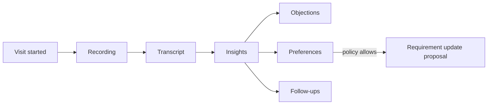

## Multi-party

Soporta:

- pareja compradora;
- familiares;
- varios agentes;
- open house;
- representantes.

## Eventos

- `VisitScheduled`
- `VisitConfirmed`
- `VisitStarted`
- `VisitNoteCaptured`
- `VisitRecordingStored`
- `VisitCompleted`
- `VisitNoShow`
- `VisitFeedbackCaptured`

---

# 9\. Negotiation

## Responsabilidad

Representar formalmente la secuencia de propuestas y contrapropuestas.

## Aggregate root: `Negotiation`

```text
Negotiation
- negotiationId
- listingId
- requirementId?
- participantGroups[]
- status
- proposals[]
- openedAt
- closedAt?
```

## `Proposal`

No separar técnicamente Offer y CounterOffer si ambos comparten semántica.

```text
Proposal
- proposalId
- sequence
- proposedBy
- proposedTo
- termsSnapshot
- validity
- conditions[]
- supportingDocumentIds[]
- createdAt
- response?
```

`termsSnapshot` es inmutable.

Puede incluir:

- monto;
- moneda;
- financiación;
- permuta;
- fechas;
- contingencias;
- bienes;
- condiciones;
- posesión;
- otros.

## Estados de negociación

```text
OPEN
ACCEPTED
REJECTED
WITHDRAWN
EXPIRED
CLOSED
```

## Behavioral metrics

No guardar etiquetas subjetivas como:

```text
"cliente difícil"
"agarra fácil"
```

Derivar read models objetivos:

```text
negotiationsCount
averageCounterProposals
averageResponseTime
acceptanceRate
withdrawalRate
usualTermFlexibility
```

Siempre por contexto y período.

## Invariantes

1.  Una Proposal emitida no se edita; se supersede con otra.
2.  Toda aceptación señala exactamente qué Proposal se acepta.
3.  Los participantes pueden ser múltiples Parties por lado.
4.  La negociación no modifica directamente la Party.
5.  El perfil comercial es derivado, no identidad.

## Eventos

- `NegotiationOpened`
- `ProposalSubmitted`
- `ProposalCountered`
- `ProposalAccepted`
- `ProposalRejected`
- `ProposalWithdrawn`
- `NegotiationClosed`

---

# 10\. Reservation & Transaction Closing

# 10.1 Reservation

## Aggregate root: `Reservation`

La reserva/seña es conceptualmente distinta de la oferta.

```text
Reservation
- reservationId
- listingId
- negotiationId?
- acceptedProposalId?
- participantRefs[]
- monetaryTerms
- conditions[]
- validFrom
- expiresAt?
- documentIds[]
- status
- custodyInfo?
```

## Estados

```text
DRAFT
PROPOSED
CONFIRMED
EXPIRED
CANCELLED
FULFILLED
```

## Invariantes

- monto y moneda son explícitos;
- condiciones son versionadas;
- cancelación tiene motivo;
- devolución/retención se registra como hecho, no se infiere silenciosamente;
- Reservation no es Transaction.

---

# 10.2 Transaction

## Aggregate root: `Transaction`

Representa el caso de cierre completo.

```text
Transaction
- transactionId
- operationType
- propertyId
- listingId?
- reservationId?
- participantRoles[]
- agreedTerms
- workflowInstanceId
- appliedWorkflowVersion
- documentComplianceSummary
- status
- importantDates
- closingOutcome
```

## Participant Roles

Ejemplos:

- BUYER
- SELLER
- LESSOR
- TENANT
- GUARANTOR
- REPRESENTATIVE
- TRUSTEE
- BENEFICIAL_OWNER
- NOTARY / external professional ref
- OTHER

No son roles permanentes de Party.

## Estados semánticos

```text
PREPARING
DUE_DILIGENCE
READY_TO_CLOSE
CLOSED
CANCELLED
FAILED
```

Los workflows tienen más detalle, pero cada etapa personalizada debe mapear a uno de estos estados.

## Workflow

No construir un BPM universal.

Se usa:

```text
WorkflowTemplate
- operationType
- jurisdiction
- packVersion
- stages[]
- tasks[]
- documentRequirements[]
- approvals[]
- SLAs[]
```

Al crear una Transaction se instancia un snapshot versionado.

## Task / Checklist

```text
Task
- taskId
- workflowInstanceId
- taskDefinitionCode
- assignee
- dueAt?
- dependencies[]
- status
- evidenceRefs[]
```

Estados:

```text
PENDING
READY
IN_PROGRESS
BLOCKED
COMPLETED
SKIPPED
CANCELLED
```

## Excepciones / approvals

No permitir “saltear porque sí”.

```text
ExceptionRequest
- exceptionId
- targetTaskId
- requestedBy
- reason
- evidence
- requiredPermission
- approvedBy?
- decision
```

Política típica:

- manager autorizado puede omitir directamente ciertas tareas;
- agent debe solicitar aprobación;
- compliance-critical task puede no admitir bypass.

## Internal notifications

Generadas por:

- vencimiento;
- aprobación;
- bloqueo;
- documento faltante;
- SLA;
- cambio de términos;
- hito de cierre.

## Closing effects

Una Transaction cerrada emite eventos; otros contexts reaccionan.

Ejemplo venta:

```text
TransactionClosed
    -> Property Registry actualiza intereses/titularidad cuando corresponde
    -> Listing se cierra
    -> Commission Calculation
    -> Analytics
```

Ejemplo locación:

```text
TransactionClosed
    -> ManagedAgreementCreated
    -> Rent Schedule
    -> Listing closed/rented
```

## Eventos

- `ReservationCreated`
- `ReservationConfirmed`
- `ReservationExpired`
- `TransactionOpened`
- `TransactionStageChanged`
- `TaskCompleted`
- `WorkflowExceptionRequested`
- `WorkflowExceptionApproved`
- `TransactionReadyToClose`
- `TransactionClosed`
- `TransactionCancelled`

---

# 11\. Commissions & Incentives

## Responsabilidad

Calcular honorarios/comisiones y distribución interna sin convertir el CRM en payroll o contabilidad.

## Aggregate: `CommissionPolicy`

```text
CommissionPolicy
- policyId
- scope
- operationTypes[]
- calculationRules[]
- splitRules[]
- incentiveRules[]
- validFrom
- validUntil?
- version
```

## Scope

Puede aplicar a:

- organización;
- sucursal;
- equipo;
- operación;
- agente;
- combinación.

Precedencia explícita.

## Aggregate: `CommissionCalculation`

```text
CommissionCalculation
- calculationId
- transactionId
- policyVersion
- inputsSnapshot
- grossCommission
- splits[]
- incentives[]
- adjustments[]
- status
```

## `CommissionSplit`

```text
beneficiaryRef
role
basis
amount
currency
```

Roles posibles:

- agente captador;
- agente de demanda;
- sucursal;
- manager;
- referido;
- inmobiliaria;
- otros.

## Defaults

Argentina tendrá templates preconfigurados, siempre editables.

No asumir que un porcentaje “típico” es una regla legal universal.

## Eventos

- `CommissionPolicyActivated`
- `CommissionCalculated`
- `CommissionAdjustmentRequested`
- `CommissionFinalized`

---

# 12\. Rental Administration

## Posición

Incluido como capability relevante, pero aislado del core comercial.

## Frontera

Sí:

- cánones;
- ajustes;
- expensas;
- depósitos;
- mora;
- pagos;
- imputaciones;
- gastos;
- liquidaciones;
- comisiones de administración;
- vencimientos;
- conciliación operativa.

No:

- contabilidad societaria;
- balances;
- plan de cuentas general;
- IVA/Ganancias/DDJJ;
- reemplazar ERP/contador.

---

## 12.1 `ManagedAgreement`

Nombre más amplio que `Lease` para no bloquear expansión rural.

```text
ManagedAgreement
- agreementId
- sourceTransactionId
- propertyId
- participantRoles[]
- agreementType
- terms
- validFrom
- validUntil
- renewalRules?
- adjustmentRules[]
- depositTerms?
- managementPolicy
- status
```

Tipos iniciales:

```text
URBAN_LEASE
COMMERCIAL_LEASE
TEMPORARY_LEASE
RURAL_LEASE
SHARECROPPING
OTHER
```

No se obliga a que todos tengan exactamente el mismo modelo económico.

## Consideration model

Puede ser:

- dinero fijo;
- dinero indexado;
- monto por hectárea;
- porcentaje;
- frutos/producción;
- combinación.

Esto es necesario para soportar operaciones rurales sin deformarlas.

---

## 12.2 `RentSchedule` / `ConsiderationSchedule`

```text
Schedule
- agreementId
- periods[]
- adjustmentRuleRefs[]
- expectedConsiderations[]
```

## `AdjustmentRule`

Debe soportar:

- índice externo;
- fórmula;
- periodicidad;
- ajuste manual con aprobación;
- moneda;
- reglas contractuales.

No hardcodear ICL, IPC u otro índice dentro de la entidad.

---

## 12.3 `Receivable`

```text
Receivable
- receivableId
- agreementId
- period
- concepts[]
- total
- currency
- dueDate
- status
```

Conceptos:

- alquiler/canon;
- expensas;
- intereses;
- servicios/gastos repercutibles;
- ajustes;
- otros.

## 12.4 `Payment`

```text
Payment
- paymentId
- payerPartyId
- receivedAt
- amount
- currency
- method
- reference
- status
```

## 12.5 `PaymentAllocation`

Un pago puede:

- ser parcial;
- cubrir varias deudas;
- incluir varios conceptos.

No igualar `Payment == Receivable`.

---

## 12.6 `Expense`

```text
Expense
- expenseId
- propertyId
- agreementId?
- concept
- amount
- currency
- paidBy
- chargeableTo
- supportingDocumentIds[]
- approval?
```

---

## 12.7 `OwnerSettlement`

```text
OwnerSettlement
- settlementId
- propertyId
- ownerPartyIds[]
- period
- receivablesCollected[]
- expenses[]
- managementFees[]
- adjustments[]
- netAmount
- currency
- status
```

## Arrears

`ArrearsCase` permite:

- deuda;
- antigüedad;
- recordatorios;
- acuerdos;
- escalation;
- seguimiento.

## Venta con locación vigente

`Property`, `Listing` y `ManagedAgreement` son independientes.

Una Property puede estar:

```text
ManagedAgreement ACTIVE
+
Listing SALE ACTIVE
```

El sistema no supone que la venta destruye la locación. El Código Civil y Comercial contempla, con las reglas y excepciones aplicables, la subsistencia de la locación ante la enajenación; la lógica concreta se tratará mediante workflows/policies legales y no mediante un booleano simplista.

## Eventos

- `ManagedAgreementCreated`
- `AgreementActivated`
- `AdjustmentCalculated`
- `ReceivableIssued`
- `PaymentReceived`
- `PaymentAllocated`
- `ArrearsDetected`
- `ExpenseRegistered`
- `OwnerSettlementCalculated`
- `OwnerSettlementFinalized`
- `AgreementExpired`
- `AgreementRenewed`

---

# 13\. Maintenance — capability opcional

## Objetivo

Cubrir property management sin obligar a todas las inmobiliarias a ver un módulo que no necesitan.

## Aggregate: `MaintenanceCase`

```text
MaintenanceCase
- caseId
- propertyId
- managedAgreementId?
- reportedBy
- category
- priority
- description
- mediaRefs[]
- status
- workOrders[]
- expenseRefs[]
```

## Flujo

```text
Reported
-> Triaged
-> Quote requested
-> Owner approval if needed
-> Work ordered
-> Completed
-> Expense allocated
-> Closed
```

## Aggregates relacionados

- `Vendor`
- `Quote`
- `WorkOrder`

Los proveedores pueden modelarse como Party si corresponde y tener un perfil de proveedor en este contexto.

## Integraciones

Eventos hacia:

- Property History
- Rental Administration
- Notifications
- Analytics

---

# 14\. Automation & AI Orchestration

## Objetivo

Automatizar sin permitir que la IA se convierta en un actor opaco con acceso irrestricto a la base.

## Regla de seguridad arquitectónica

> **Ningún LLM/subagente consulta MongoDB directamente.**

Usa:

- domain APIs;
- query services;
- read models autorizados;
- commands;
- explicit tools.

Siempre dentro del scope del usuario/servicio que originó la acción.

---

## 14.1 Automation

### `AutomationPolicy`

```text
AutomationPolicy
- policyId
- trigger
- conditions[]
- actions[]
- SLA?
- approvalPolicy?
- enabled
- version
```

Ejemplo:

```text
WHEN InquiryCreated
IF classificationConfidence > X
THEN assign
THEN send acknowledgement
THEN create follow-up
THEN run matching

IF no human response before SLA
THEN escalate
```

## `AutomationExecution`

```text
executionId
policyVersion
triggerEventId
steps[]
status
correlationId
```

Debe ser idempotente.

---

## 14.2 AI Orchestration

Los subagentes son actores tecnológicos, **no Party ni User humano**.

Especialistas posibles:

- Conversation Router
- Buyer/Requirement Agent
- Captation Agent
- Rental Agent
- Rural Agent
- Document/Compliance Assistant
- Scheduling Agent
- Management Copilot

## Handoff

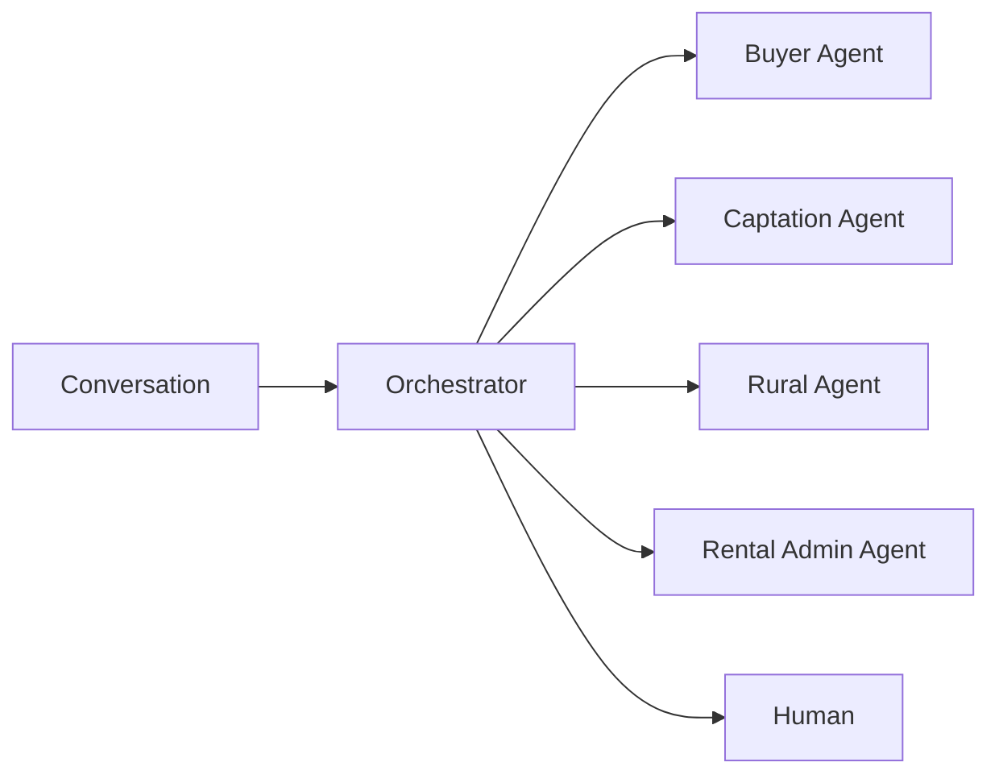

Una conversación puede activar varios especialistas.

Ejemplo:

> “Quiero vender mi departamento y comprar una casa en Pilar financiando la diferencia.”

Puede producir:

- CaptationCase;
- Requirement;
- Financing-related criteria;
- tasks;
- human handoff.

---

## 14.3 Autonomy modes

Por capability/acción:

```text
SUGGEST_ONLY
REQUIRE_APPROVAL
AUTO_EXECUTE_WITH_GUARDRAILS
AUTO_EXECUTE
```

No existe un único “AI enabled=true”.

Ejemplo:

```text
Extraer una preferencia -> AUTO_EXECUTE_WITH_GUARDRAILS
Cambiar REQUIRED -> REQUIRE_APPROVAL
Mandar saludo inicial -> AUTO_EXECUTE
Omitir requisito de compliance -> NEVER / HUMAN ONLY
```

---

## 14.4 `AgentDecision`

Toda decisión relevante:

```text
AgentDecision
- decisionId
- agentType
- modelRef
- task
- inputEvidenceRefs[]
- output
- confidence
- policyVersion
- action
- approval?
- outcome?
- createdAt
```

No se persiste chain-of-thought interno; se guarda una **justificación operacional resumida**, evidencia y parámetros suficientes para auditoría.

## Eventos

- `AutomationTriggered`
- `AutomationActionExecuted`
- `AutomationEscalated`
- `AIActionSuggested`
- `AIActionApproved`
- `AIActionExecuted`
- `AIHandoffRequested`
- `AIOutcomeMeasured`

---

# 15\. Notifications

## Dos categorías

### Internal Notification

Para empleados:

- aprobación requerida;
- SLA;
- documento faltante;
- oferta recibida;
- visita reprogramada;
- alquiler en mora;
- contrato por vencer.

### External Reminder

Al cliente:

- visita;
- tasación;
- firma;
- vencimiento;
- documentación;
- seguimiento.

Los mensajes externos enviados deben terminar registrados como `Interaction`.

## `Notification`

```text
Notification
- notificationId
- recipient
- category
- priority
- sourceRef
- deliveryChannels[]
- status
- createdAt
```

## Recordatorios

Se definen por política y pueden usar:

- push;
- WhatsApp;
- email;
- SMS futuro;
- in-app.

---

# 16\. Analytics & Management Copilot

## Objetivo

Que toda métrica pueda explicar de dónde sale.

## Regla

> **No metric without lineage.**

## `MetricDefinition`

```text
MetricDefinition
- metricCode
- semanticDefinition
- formulaVersion
- sourceEvents[]
- dimensions[]
- exclusions[]
- effectiveFrom
```

## `MetricObservation`

```text
metricCode
period
dimensions
value
sourceProjectionVersion
lineageRefs[]
calculatedAt
```

## Métricas core

### Agente / sucursal

- tiempo medio de primera respuesta;
- Inquiry → proceso calificado;
- Requirements activos;
- CaptationCases activos;
- captación → mandato;
- mandato → Listing;
- Match → Visit;
- Visit → Negotiation;
- Negotiation → Reservation;
- Reservation → Closed Transaction;
- operaciones cerradas / agente activo;
- tareas administrativas por operación;
- SLA misses.

### Property / Listing

- aging;
- consultas;
- unique Parties interesadas;
- matches;
- visitas;
- ofertas;
- evolución de precio;
- precio/m² o ha;
- velocidad de absorción;
- demanda compatible;
- elasticidad observada frente a cambios de términos.

### Tasaciones

- desviación tasación vs cierre;
- tiempo hasta cierre;
- precisión por valuador;
- gap expectativa propietario vs tasación.

### Party

Solo métricas observables:

- recurrencia;
- cantidad de operaciones;
- respuesta promedio;
- comportamiento de negociación;
- canales utilizados.

Evitar etiquetas subjetivas no explicables.

### Rental Admin

- mora;
- aging de deuda;
- cobrado/esperado;
- próximos ajustes;
- contratos por vencer;
- liquidaciones pendientes.

---

## 16.1 Management Copilot

Chat para managers/directores/agentes según alcance.

Preguntas:

- “¿Qué captaciones debería priorizar hoy?”
- “¿Qué agentes tienen inquiries sin responder?”
- “¿Qué propiedades de Palermo tienen mucha demanda y pocas visitas?”
- “¿Qué contratos vencen en los próximos 60 días?”
- “¿Qué tasador está quedando sistemáticamente por arriba del precio de cierre?”
- “¿Qué alquileres tienen deuda?”

Arquitectura lógica:

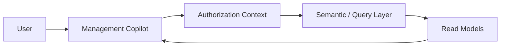

Prohibido:

```text
LLM -> Mongo raw query
```

El Copilot hereda permisos y scope.

---

# 17\. External Portals — capabilities opcionales

No deben crear nuevos sources-of-truth duplicados.

## Owner Portal

Puede consultar:

- properties;
- listings;
- actividad seleccionada;
- visitas;
- contratos;
- liquidaciones;
- pagos;
- documentos;
- maintenance cases;
- próximos eventos.

## Tenant Portal

Puede consultar:

- ManagedAgreement;
- próximos vencimientos;
- recibos/pagos;
- ajustes;
- documentos;
- maintenance cases;
- mensajes.

## Objetivo

- transparencia;
- autoservicio;
- menor carga de agentes;
- retención del cliente dentro del ecosistema.

Las acciones del portal se traducen a comandos de los bounded contexts existentes.

---

# 18\. Flujos end-to-end

# 18.1 Entrada omnicanal a Requirement

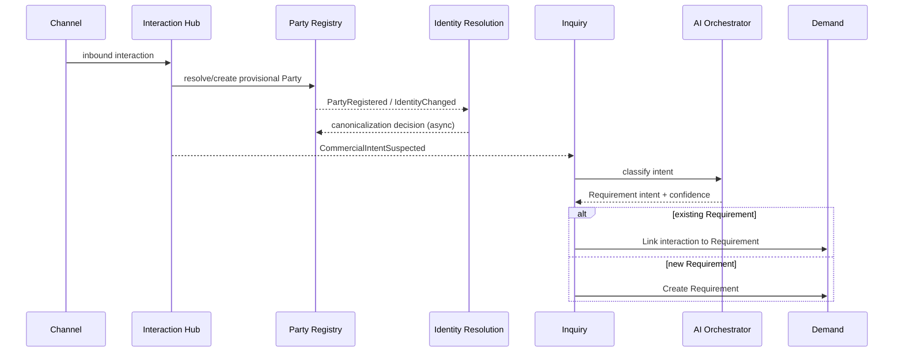

Identity Resolution no bloquea el contacto.

---

# 18.2 Captación a Listing

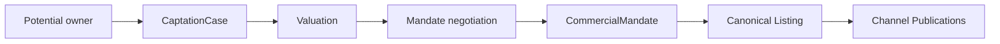

---

# 18.3 Listing a cierre

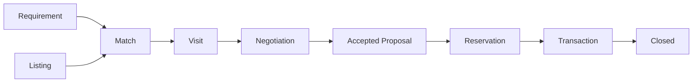

No todos los casos requieren exactamente todos los pasos; el workflow pack define variantes.

---

# 18.4 Locación a administración

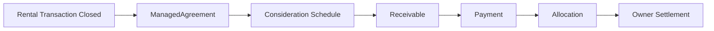

---

# 18.5 Venta de inmueble ya alquilado

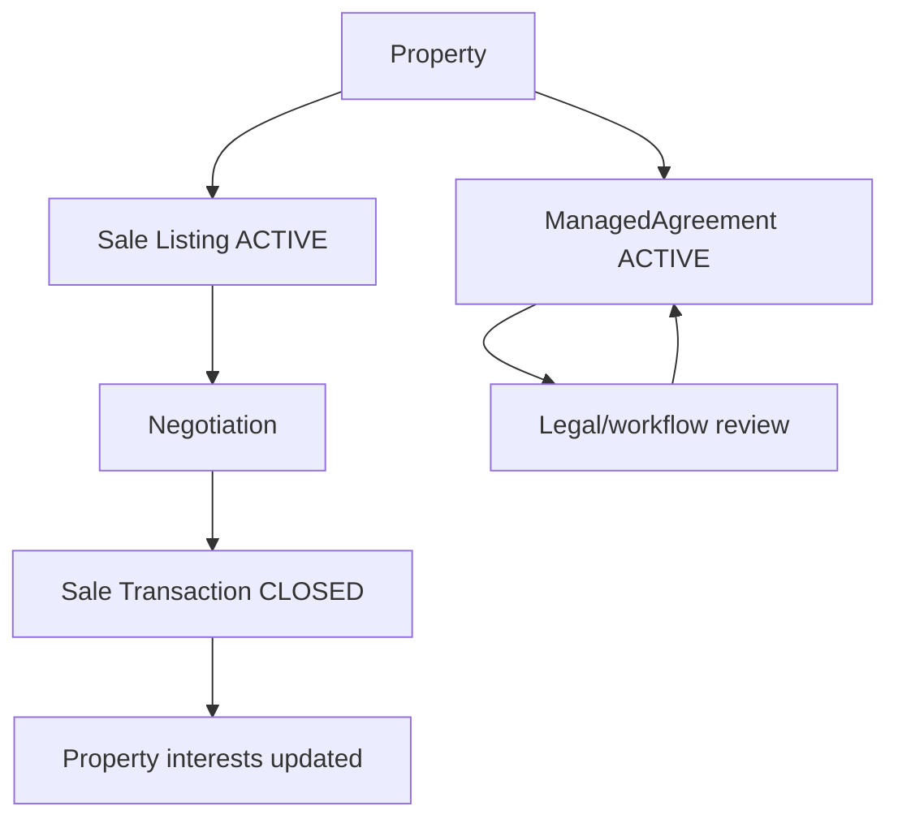

No hay dependencia artificial `sale => terminate lease`.

---

# 19\. Domain Event Model

## Envelope

Todo integration event debe tener:

```text
eventId
eventType
eventVersion
tenantId
aggregateType
aggregateId
aggregateVersion
occurredAt

actor:
  type
  id

correlationId
causationId
source
payload
```

## Actor types

```text
HUMAN_USER
EXTERNAL_PARTY
AI_AGENT
SYSTEM
INTEGRATION
```

Si es IA:

```text
agentType
modelRef
decisionId?
```

## Reglas

1.  Evento publicado = inmutable.
2.  Schema versionado.
3.  Consumer idempotente.
4.  `correlationId` atraviesa flujos cross-context.
5.  Eventos internos de dominio pueden ser más ricos; integration events exponen solo contrato público.
6.  No publicar documentos completos/PII innecesaria en el bus.
7.  No usar eventos como excusa para compartir modelos internos.

---

# 20\. MongoDB — implicancias del modelo

Este documento no define todavía la arquitectura física final, pero el dominio se diseña conscientemente para MongoDB.

## 20.1 Collection por aggregate root

Ejemplos:

```text
parties
party_relationships

identity_resolution_cases

properties
property_interests
valuations
captation_cases
commercial_mandates

listings
channel_publications

conversations
interactions

inquiries
requirements
match_cases

visits
negotiations
reservations
transactions

managed_agreements
receivables
payments
payment_allocations
owner_settlements
```

La collection física final puede variar, pero el límite de aggregate debe preservarse.

---

## 20.2 Qué embebemos

Embebemos cuando:

- lifecycle está totalmente subordinado al root;
- cardinalidad está acotada;
- se actualiza atómicamente con el root;
- no necesita query global independiente.

Ejemplos posibles:

- pequeños `RequirementCriterion[]`;
- `Proposal[]` si la negociación tiene volumen naturalmente acotado;
- `CommercialTerms`;
- `ValuationValue[]`.

## Qué referenciamos

Referenciamos cuando:

- crece sin límite;
- tiene lifecycle propio;
- necesita búsquedas independientes;
- recibe alta concurrencia;
- pertenece a otro bounded context.

Ejemplos:

- Interactions;
- Documents;
- Property children;
- Payments;
- Parties;
- Listings;
- Visits;
- Transaction tasks si el volumen puede crecer significativamente.

---

## 20.3 Evitar documentos gigantes

Anti-pattern:

```json
{
  "party": {
    "allInteractionsEver": [],
    "allRequirementsEver": [],
    "allTransactionsEver": [],
    "allDocumentsEver": []
  }
}
```

Correcto:

```text
Party current aggregate
+
independent aggregates
+
read models optimizados
```

---

## 20.4 `tenantId`

Todo documento tenant-owned incluye:

```text
tenantId / organizationId
```

Índices únicos deben ser tenant-aware cuando corresponda.

Ejemplo conceptual:

```text
unique(organizationId, normalizedTaxId)
```

si la regla de negocio lo permite.

---

## 20.5 Optimistic concurrency

Cada aggregate:

```text
version
```

Los commands escriben:

```text
expectedVersion
```

Evita lost updates.

---

## 20.6 Outbox / Inbox

Los eventos no deben depender de “guardar y después publicar”.

Cada servicio necesitará un patrón equivalente a:

```text
business write
+
outbox event
```

en una frontera transaccional coherente.

Consumers:

```text
Inbox
- eventId
- consumer
- processedAt
```

para idempotencia.

No usar Mongo Change Streams como sustituto conceptual de domain events: pueden ser un mecanismo de transporte/CDC, pero el evento de negocio debe ser explícito.

---

## 20.7 Read models

Para UX ultra rápida:

- dashboards;
- search;
- profile 360;
- property 360;
- agent workbench;
- management cockpit.

pueden usar proyecciones denormalizadas.

Ejemplo `party_360_read_model`:

```text
party summary
active requirements
active captations
recent interactions
next tasks
active negotiations
managed agreements
risk/compliance summary
```

No es source-of-truth.

---

# 21\. Modelo de autorización transversal

Toda query/command debe recibir:

```text
ExecutionContext
- organizationId
- actor
- memberships
- permissions
- scopes
- correlationId
```

Ejemplo:

```text
CanReadRequirement(user, requirement):

permission("requirements.read")
AND
scope allows requirement.assignment
```

Para IA:

```text
AI ExecutionContext
inherits initiator scope
+
agent capability policy
+
action-specific guardrails
```

Un subagente nunca obtiene más permisos que el contexto delegado.

---

# 22\. Source of truth por concepto

| Concepto                       | Bounded context owner               |
| ------------------------------ | ----------------------------------- |
| estructura organizacional      | Organization & Access               |
| identidad de Party             | Party Registry                      |
| resolución de duplicados       | Identity Resolution                 |
| inmueble físico                | Property Registry                   |
| derecho/interés sobre inmueble | Property Registry / legal subdomain |
| captación                      | Captation                           |
| tasación                       | Captation & Valuation               |
| mandato/autorización           | Captation & Valuation               |
| oferta comercial               | Listing                             |
| publicación portal             | Syndication                         |
| conversación/interacción       | Interaction Hub                     |
| intención no resuelta          | Inquiry                             |
| necesidad del cliente          | Requirement                         |
| compatibilidad                 | Matching                            |
| agenda                         | Scheduling                          |
| visita                         | Visits                              |
| negociación                    | Negotiation                         |
| reserva                        | Reservation                         |
| cierre                         | Transaction                         |
| documento                      | Documents                           |
| cumplimiento                   | Compliance                          |
| comisión                       | Commissions                         |
| contrato administrado          | Rental Administration               |
| cobro/deuda operativa          | Rental Administration               |
| mantenimiento                  | Maintenance                         |
| automatización                 | Automation                          |
| métricas                       | Analytics (derivadas)               |

---

# 23\. Invariantes globales

1.  **No existe Lead permanente.**
2.  Toda interacción conserva canal, timestamp y provenance.
3.  Una Party puede tener N roles simultáneos sin duplicarse.
4.  Un `UserAccount` no es una `Party`.
5.  Identidad y autorización son dominios distintos.
6.  Identity Resolution se dispara solo con datos identificatorios relevantes.
7.  Un merge de identidad debe ser auditable y reversible.
8.  `Property != Listing`.
9.  Property tiene lifecycle independiente de sus listings.
10. Una Property puede contener o relacionarse con otras Properties sin formar un documento Mongo monolítico.
11. Titularidad no es `ownerId`: se modelan intereses/derechos.
12. Una Valuation histórica no se sobrescribe.
13. Una CaptationCase no es un Listing.
14. Un CommercialMandate tiene vigencia y alcance propios.
15. Listing soporta múltiples modalidades y términos económicos complejos.
16. Canonical Listing no se duplica completo por portal.
17. Cada canal guarda solo overrides cuando hacen falta.
18. Una Party puede tener N Requirements activos.
19. `importance` y `confidence` son conceptos distintos.
20. Todo criterio inferido conserva provenance.
21. Match score debe ser explicable y versionado.
22. Feedback de descarte es información de dominio.
23. Visit admite N participantes y N agentes.
24. Grabaciones requieren política/consentimiento aplicable.
25. Proposal emitida es inmutable.
26. Reservation != accepted Proposal != Transaction.
27. Workflows estándar pueden extenderse, pero cada etapa mapea a un semantic state común.
28. Saltear una tarea relevante requiere policy/permission/approval.
29. Cerrar una venta no borra contratos previos ni historial.
30. Rental Administration es ledger operativo, no contabilidad general.
31. Comisiones se calculan mediante policy versionada.
32. IA no accede a Mongo directamente.
33. IA opera con scope delegado y nivel de autonomía configurado.
34. Toda acción automática relevante es auditable.
35. Los mensajes externos producidos por automatización vuelven como Interaction.
36. Analytics no se convierte en source-of-truth.
37. Toda métrica importante debe tener lineage.
38. Ningún bounded context lee colecciones privadas de otro.
39. Cada integration event es versionado e idempotente.
40. Los packs aplicados a una operación quedan fijados por versión.

---

# 24\. Domain state vs custom stages

Para permitir personalización sin destruir el modelo:

```text
Custom Stage
    ↓ maps to
Semantic State
```

Ejemplo:

```text
"Esperando escribanía"
"Informe de dominio"
"Documentos del comprador"

todos pueden mapear a:

Transaction Semantic State = DUE_DILIGENCE
```

Esto permite:

- UX personalizada;
- workflows propios;
- analytics consistente;
- automatizaciones semánticas;
- migraciones de pack.

Nunca permitir que cada inmobiliaria invente semántica incompatible para los estados core.

---

# 25\. Scoring domains separados

No crear un “score universal”.

## `IdentityMatchScore`

Pregunta:

> ¿Es la misma Party?

## `CaptationPriorityScore`

Pregunta:

> ¿Dónde conviene invertir tiempo para captar oferta?

## `MatchScore`

Pregunta:

> ¿Cuánto encaja este Listing con este Requirement?

## `CommercializationScore`

Pregunta:

> ¿Qué tan colocable parece este Listing dadas sus condiciones y mercado?

## `InteractionIntentConfidence`

Pregunta:

> ¿Qué tan seguros estamos de haber entendido la intención?

## `AIActionConfidence`

Pregunta:

> ¿Qué tan segura es una acción automatizada?

Todos tienen:

```text
score
version
inputs
drivers/evidence
calculatedAt
```

Nunca mezclar semánticas porque todos “son un número entre 0 y 100”.

---

# 26\. Rural Real Estate como dominio first-class

El producto no debe tratar el campo como “un terreno grande”.

## Particularidades contempladas

### Unidad física

- hectáreas;
- fracciones;
- mejoras;
- instalaciones;
- infraestructura;
- accesos;
- agua;
- aptitud.

### Economía

- valor por hectárea;
- diferentes monedas;
- pagos mixtos;
- financiación;
- productividad;
- arrendamiento;
- porcentaje de frutos/producción;
- aparcería/mediería.

### Jerarquía

```text
Establecimiento
├── fracciones
├── casco
├── viviendas
├── galpones
├── silos
├── corrales
├── feedlot
└── infraestructura hídrica
```

### Matching rural

Requirements pueden expresar:

```text
zona productiva
mínimo de ha
aptitud agrícola/ganadera/mixta
tipo de suelo
agua
mejoras
distancia a ruta
infraestructura
rinde/producción
modalidad económica
```

### Analytics rural

- precio/ha;
- tiempo de colocación;
- absorción por zona;
- demanda por aptitud;
- evolución de tasaciones;
- términos aceptados;
- performance de arrendamientos;
- comparables.

---

# 27\. Agent Workbench — consecuencia del dominio

Aunque todavía no se diseña la UI, el dominio debe permitir una pantalla extremadamente simple:

```text
HOY

1. Responder a María — inquiry hace 4 min
2. Llamar propietario P-221 — captación score 96
3. Confirmar visita — 16:30
4. Revisar propuesta — vence hoy
5. Documento pendiente — operación T-81

NUEVAS OPORTUNIDADES

- 7 matches > 90%
- 2 captaciones de alta prioridad
```

El agente no navega 25 módulos para saber qué hacer.

El sistema deriva trabajo de:

- eventos;
- SLA;
- scoring;
- workflow;
- agenda;
- IA.

---

# 28\. Manager/Director Workbench

Debe poder responder:

```text
Qué está trabado
Qué se está enfriando
Dónde hay demanda sin oferta
Dónde hay oferta sin demanda
Quién no responde
Qué sucursal convierte mejor
Qué agente necesita ayuda
Qué captación conviene priorizar
Qué contratos vencen
Qué alquileres están en mora
Qué documentación falta
```

La experiencia puede ser:

- dashboard;
- alertas;
- Management Copilot.

La respuesta debe siempre respetar autorización y mostrar lineage cuando se solicita.

---

# 29\. Modelo de responsabilidad humana / IA

## Actor humano

Responsable legal/operativo cuando corresponde.

## AI Agent

Puede:

- clasificar;
- extraer;
- proponer;
- resumir;
- actualizar bajo guardrails;
- ejecutar acciones rutinarias;
- enrutar;
- recordar;
- priorizar.

No debe:

- borrar evidencia;
- saltar controles no delegables;
- aumentar su propio scope;
- fingir certeza;
- modificar decisiones históricas;
- ejecutar decisiones sensibles fuera de la policy vigente.

## Human handoff

Debe transferir:

```text
summary
source interactions
current intent
confidence
open questions
recommended next action
linked domain entities
```

No obligar al agente humano a releer 200 mensajes.

---

# 30\. Pseudo-documentos Mongo representativos

## Party

```json
{
  "_id": "pty_123",
  "organizationId": "org_1",
  "kind": "NATURAL_PERSON",
  "status": "ACTIVE",
  "displayName": "Juan Pérez",
  "profile": {
    "givenNames": ["Juan"],
    "familyNames": ["Pérez"],
    "nationalities": ["AR"]
  },
  "contactPoints": [
    {
      "type": "WHATSAPP",
      "normalizedValue": "+54911...",
      "verified": true
    }
  ],
  "identityDocuments": [
    {
      "type": "DNI",
      "issuerCountry": "AR",
      "number": "...",
      "verifiedStatus": "VERIFIED"
    }
  ],
  "version": 7
}
```

No contiene:

```text
requirements[]
interactions[]
transactions[]
documents[]
```

---

## Property

```json
{
  "_id": "prp_10",
  "organizationId": "org_1",
  "propertyType": "APARTMENT",
  "parentPropertyId": "prp_building_4",
  "location": {},
  "areas": {},
  "physicalAttributes": {},
  "status": "ACTIVE",
  "version": 12
}
```

---

## Requirement

```json
{
  "_id": "req_99",
  "organizationId": "org_1",
  "seekerPartyIds": ["pty_123"],
  "operationTypes": ["PURCHASE"],
  "status": "ACTIVE",
  "criteria": [
    {
      "criterionId": "c1",
      "type": "BEDROOMS_MIN",
      "value": 3,
      "importance": "REQUIRED",
      "confidence": 0.99,
      "sourceInteractionIds": ["int_700"]
    },
    {
      "criterionId": "c2",
      "type": "POOL",
      "value": true,
      "importance": "PREFERRED",
      "confidence": 0.91,
      "sourceInteractionIds": ["int_701"]
    }
  ],
  "version": 4
}
```

---

## Listing

```json
{
  "_id": "lst_50",
  "organizationId": "org_1",
  "propertyId": "prp_10",
  "operationType": "SALE",
  "status": "ACTIVE",
  "canonicalPresentation": {},
  "commercialTerms": {
    "considerations": [
      {
        "type": "MONEY",
        "currency": "USD",
        "amount": 300000
      }
    ],
    "exchangeAccepted": true,
    "negotiable": true
  },
  "version": 8
}
```

---

# 31\. Eventos principales por journey

## Party / Identity

```text
PartyRegistered
PartyIdentityAttributesChanged
IdentityReviewRequested
IdentityMatchConfirmed
```

## Captación

```text
CaptationCaseOpened
ValuationIssued
CommercialMandateGranted
CaptationCaptured
```

## Listing

```text
ListingActivated
ListingCommercialTermsChanged
ChannelPublicationPublished
```

## Demand

```text
InteractionReceived
InquiryCreated
RequirementCreated
RequirementCriterionChanged
```

## Matching

```text
MatchCalculated
MatchPresented
MatchDiscarded
```

## Visit

```text
VisitScheduled
VisitCompleted
VisitFeedbackCaptured
```

## Negotiation / Close

```text
NegotiationOpened
ProposalSubmitted
ProposalAccepted
ReservationConfirmed
TransactionOpened
TransactionClosed
```

## Rental

```text
ManagedAgreementCreated
ReceivableIssued
PaymentReceived
ArrearsDetected
OwnerSettlementFinalized
```

---

# 32\. Candidate commands

## Party

```text
RegisterParty
AddIdentityDocument
ChangeIdentityAttributes
CreatePartyRelationship
AliasPartyToCanonical
```

## Captation

```text
OpenCaptationCase
RequestValuation
IssueValuation
GrantCommercialMandate
CloseCaptationAsLost
```

## Listing

```text
CreateListing
ActivateListing
ChangeCommercialTerms
PauseListing
CloseListing
```

## Demand

```text
CreateInquiry
QualifyInquiry
CreateRequirement
AddRequirementCriterion
ConfirmRequirementCriterion
PauseRequirement
```

## Matching

```text
RecalculateMatch
PresentMatch
RecordMatchFeedback
```

## Visit

```text
ScheduleVisit
ConfirmVisit
StartVisit
AddVisitNote
AttachVisitRecording
CompleteVisit
```

## Negotiation

```text
OpenNegotiation
SubmitProposal
AcceptProposal
RejectProposal
WithdrawProposal
```

## Closing

```text
CreateReservation
ConfirmReservation
OpenTransaction
CompleteTask
RequestWorkflowException
ApproveWorkflowException
CloseTransaction
```

## Rental

```text
CreateManagedAgreement
GenerateReceivables
RegisterPayment
AllocatePayment
RegisterExpense
CalculateOwnerSettlement
```

---

# 33\. Query/read models necesarios

La UI no debería componer 15 APIs para pintar una pantalla.

Necesitamos read models específicos.

## `Party360`

- identidad canónica;
- relationships;
- active Requirements;
- active Captations;
- recent Interactions;
- Visits;
- Negotiations;
- Transactions;
- Managed Agreements;
- docs/compliance summary;
- next actions.

## `Property360`

- estructura;
- datos físicos;
- titulares/intereses;
- historia significativa;
- tasaciones;
- captaciones;
- listings;
- demanda compatible;
- visitas;
- operaciones;
- agreement activo;
- maintenance.

## `AgentToday`

- nuevas inquiries;
- tareas;
- SLA;
- contactos recomendados;
- matches;
- visitas;
- ofertas;
- documentos;
- seguimientos.

## `ManagerCockpit`

- funnel;
- aging;
- workload;
- SLA;
- priority opportunities;
- branch performance;
- rental alerts;
- compliance blockers.

## `ListingPerformance`

- views/imported stats;
- inquiries;
- unique parties;
- matches;
- presentations;
- visits;
- proposals;
- price changes;
- days active.

---

# 34\. Ownership y consistencia entre contexts

## Consistencia fuerte

Dentro del aggregate.

Ejemplo:

```text
AcceptProposal
```

valida atómicamente el estado de `Negotiation`.

## Consistencia eventual

Entre bounded contexts.

Ejemplo:

```text
TransactionClosed
```

puede tardar brevemente en reflejarse en:

- Property360;
- Analytics;
- Commission;
- Listing Syndication.

La UX debe poder manejar estado `PROCESSING` donde corresponda.

## Nunca

```text
Transaction service:
db.properties.updateOne(...)
```

Debe emitir/comandar al owner correspondiente.

---

# 35\. Idempotencia

Es crítica porque tendremos:

- webhooks;
- portales;
- WhatsApp;
- reintentos;
- event bus;
- pagos;
- calendarios.

Commands externos deben aceptar:

```text
idempotencyKey
```

Integration events:

```text
eventId
```

Consumers guardan processing state.

---

# 36\. Data provenance

Todo dato relevante puede tener:

```text
sourceType
sourceId
capturedAt
capturedBy
confidence?
confirmedBy?
```

Fuentes:

```text
HUMAN_ENTRY
CLIENT_MESSAGE
PHONE_TRANSCRIPT
VISIT_TRANSCRIPT
PORTAL
IMPORT
DOCUMENT_EXTRACTION
AI_INFERENCE
SYSTEM_CALCULATION
EXTERNAL_API
```

Esto será indispensable para:

- auditoría;
- IA;
- calidad;
- debugging;
- dispute resolution;
- analytics.

---

# 37\. Data quality

Se debe distinguir:

```text
UNKNOWN
NOT_APPLICABLE
DECLINED_TO_PROVIDE
NOT_YET_VERIFIED
```

de:

```text
null
```

cuando la semántica lo justifique.

Particularmente para:

- identidad;
- documentación;
- compliance;
- criterios de Requirement;
- datos de propiedades.

No llenar la UI de estas distinciones: el dominio las conserva y la experiencia muestra solo lo necesario.

---

# 38\. Search vs Domain

Full-text search, geo-search y vector search son capacidades técnicas.

No deben convertirse en source-of-truth.

Ejemplo:

```text
Property Registry -> PropertyChanged
    -> Search projection

Requirement -> Matching query
    -> Search index / geo engine
    -> candidates
    -> domain scoring
```

El índice puede reconstruirse desde fuentes oficiales.

---

# 39\. Caché — consideración de dominio

La futura arquitectura podrá usar caché en memoria/Redis para:

- permisos;
- pack definitions;
- property summaries;
- listing summaries;
- match candidate sets;
- read models;
- reference data.

Nunca usar caché como único lugar donde exista:

- aceptación de oferta;
- pago;
- reserva;
- consentimiento;
- compliance decision.

La estrategia concreta se define en arquitectura, no en el modelo de dominio.

---

# 40\. Lo que conscientemente NO modelamos como aggregate

## `Lead`

Eliminado.

## `Customer`

Demasiado ambiguo. Usamos Party + rol contextual.

## `Opportunity`

No se introduce por costumbre.

Los procesos reales son:

- Requirement;
- CaptationCase;
- Negotiation;
- Transaction.

Si en el futuro aparece un concepto real que no pueda expresarse con ellos, se evalúa.

## `AI Agent` como Party/User

No.

## `Dashboard`

Es read model.

## `Score`

No es entidad genérica universal.

## `CustomField` sin schema

Evitar.

---

# 41\. North Star y outcome model

## North Star

```text
Closed Transactions / Active Agent
```

con guardrail:

```text
Administrative Effort / Closed Transaction
```

Objetivo:

> cerrar más operaciones por agente sin hacer que el agente trabaje más administrativamente.

## Drivers

```text
↓ first response time
↓ unhandled inquiries
↑ qualified intent rate
↑ captation conversion
↑ relevant matches
↑ visit conversion
↑ proposal conversion
↑ reservation conversion
↓ listing aging
↓ manual data entry
↑ recurrent Parties
↑ document completeness
```

---

# 42\. Setup plug-and-play propuesto

Esto se diseñará en detalle después, pero el dominio debe soportarlo.

## Paso 1

```text
Nombre inmobiliaria
País = Argentina
Zona/s principal/es
```

## Paso 2

```text
Sucursales / unidades
```

Defaults si solo hay una:

```text
Casa Central
```

## Paso 3

Invitar personas y elegir perfiles simples:

```text
Agente
Gerente
Director
Administración
```

Por debajo se crean memberships/roles/scopes.

## Paso 4

Elegir capabilities:

```text
[✓] Venta
[✓] Alquiler
[ ] Administración de alquileres
[ ] Mantenimiento
[ ] Portales
```

No mostrar 50 toggles.

## Paso 5

Conectar canales.

## Resultado

Se activan automáticamente:

- Argentina Base Pack;
- workflow pack;
- documentación;
- roles;
- automation defaults;
- notification defaults;
- commission defaults editables.

---

# 43\. Riesgos de diseño a evitar

## 43.1 Party gigante

No convertir Party en:

```text
persona + CRM + todos los mensajes + todos los contratos
```

## 43.2 Property gigante

No embebemos edificios enteros.

## 43.3 Shared database coupling

Mongo compartido físicamente no significa modelo compartido.

## 43.4 “Microservicio por entidad”

No crear:

```text
PartyService
PhoneService
EmailService
AddressService
BedroomService
```

Las fronteras siguen business capabilities.

## 43.5 Workflow genérico demasiado pronto

Opinionated templates + extensiones.

## 43.6 IA sin provenance

No aceptar datos inferidos sin fuente/confidence.

## 43.7 Over-automation

No arrancar con autonomía máxima.

## 43.8 Métricas irreproducibles

Toda fórmula versionada.

## 43.9 Overrides sin semantic state

Rompería analytics.

## 43.10 Rural como `LAND`

Es un error de producto.

---

# 44\. Priorización conceptual de bounded contexts

No implica roadmap temporal; muestra importancia para el núcleo.

## Tier A — Núcleo comercial

- Organization & Access
- Party Registry
- Identity Resolution
- Property Registry
- Captation & Valuation
- Listing
- Conversation & Interaction Hub
- Inquiry & Requirement
- Matching
- Visits
- Negotiation
- Reservation & Transaction

## Tier B — Operabilidad indispensable

- Documents & Compliance
- Scheduling
- Notifications
- Commissions
- Automation
- Analytics

## Tier C — expansión de alto valor

- Rental Administration
- AI Orchestration avanzada
- Syndication multiportal avanzada
- Management Copilot

## Tier D — capabilities adicionales

- Maintenance
- Owner Portal
- Tenant Portal
- Telephony avanzada
- canal marketplace propio

---

# 45\. Microservice-readiness checklist

Un bounded context se considera preparado para separación física si:

- [ ] tiene ownership claro de datos;
- [ ] no importa repositories de otro contexto;
- [ ] no comparte aggregates;
- [ ] expone contratos públicos;
- [ ] sus eventos tienen schema versionado;
- [ ] consumers son idempotentes;
- [ ] tiene read models propios o explícitos;
- [ ] tiene observabilidad definida;
- [ ] tiene SLA/NFR claros;
- [ ] su consistencia cross-context está explicitada;
- [ ] puede migrar su persistencia sin que otros contexts lean tablas/collections;
- [ ] tiene tests de contrato.

---

# 46\. Hipótesis de agrupación futura de servicios

**No es todavía la arquitectura final.** Sirve para verificar que el dominio no obliga a 30 deployables.

Una agrupación inicial razonable podría ser:

```text
1. Organization & Access
2. Party & Identity
3. Property
4. Supply (Captation + Valuation + Listing)
5. Interaction Hub
6. Demand
7. Matching
8. Commercial Execution (Visit + Negotiation)
9. Closing
10. Documents & Compliance
11. Rental Administration
12. Automation & Notifications
13. Analytics / Copilot
```

Syndication, Maintenance y otros pueden separarse según carga/capability.

La decisión final se tomará con NFRs y carga esperada.

---

# 47\. Investigación y fundamentos

El diseño no surge únicamente de analogías con CRMs existentes.

## CRM y customer journey

**Payne, A. & Frow, P. (2005). _A Strategic Framework for Customer Relationship Management_. Journal of Marketing, 69(4), 167–176. DOI: 10.1509/jmkg.2005.69.4.167.**

Aporta la visión de CRM como conjunto de procesos cross-functional, incluyendo integración multicanal, gestión de información, creación de valor y medición. Esto respalda separar `Interaction` de la identidad y conservar el journey completo.

**Lemon, K. N. & Verhoef, P. C. (2016). _Understanding Customer Experience Throughout the Customer Journey_. Journal of Marketing, 80(6), 69–96. DOI: 10.1509/jm.15.0420.**

Refuerza que el cliente interactúa mediante múltiples touchpoints y canales a lo largo del tiempo. Sustenta la decisión de no generar un “lead nuevo” por cada contacto.

## Entity Resolution

**Binette, O. & Steorts, R. C. (2022). _(Almost) All of Entity Resolution_. Science Advances, 8(12), eabi8021. DOI: 10.1126/sciadv.abi8021.**

Revisa métodos determinísticos, probabilísticos y human-in-the-loop. Sustenta el diseño de Identity Resolution con evidencia ponderada, incertidumbre, thresholds y revisión humana, en lugar de una igualdad determinística simple.

**Aleshin-Guendel, S. & Steorts, R. C. (2024). _Convergence Diagnostics for Entity Resolution_. Annual Review of Statistics and Its Application, 11, 419–435. DOI: 10.1146/annurev-statistics-040522-114848.**

Refuerza que entity resolution es una inferencia con incertidumbre y no meramente un `unique constraint`.

## DDD / microservices

**Vera-Rivera, F. H., Gaona, C. & Astudillo, H. (2021). _Defining and measuring microservice granularity—a literature overview_. PeerJ Computer Science 7:e695. DOI: 10.7717/peerj-cs.695.**

La revisión muestra que la granularidad óptima de microservicios sigue siendo un problema abierto y que las decisiones deben considerar coupling, cohesión, performance, recursos y dominio. Sustenta diseñar bounded contexts rigurosos antes de forzar deployables 1:1.

**Özkan, O., Babur, Ö. & van den Brand, M. _Domain-Driven Design in Software Development: A Systematic Literature Review on Implementation, Challenges, and Effectiveness_.**

La revisión resalta Ubiquitous Language, Bounded Contexts y Domain Events como artefactos centrales de DDD y su uso creciente para descomponer sistemas en microservicios.

**Overeem et al. (2021). _An empirical characterization of event sourced systems and their schema evolution — Lessons from industry_. Journal of Systems and Software, 178, 110970. DOI: 10.1016/j.jss.2021.110970.**

Sustenta evitar Event Sourcing indiscriminado: aporta beneficios de historia y auditabilidad, pero también introduce desafíos de schema evolution y operación. Por eso este modelo propone current state + meaningful domain history + audit.

---

# 48\. Normativa argentina considerada en el diseño

## Resolución UIF 43/2024

Fuente oficial: Argentina.gob.ar, texto de la Resolución 43/2024.

Impacto de diseño:

- Party debe soportar persona humana, jurídica y estructura jurídica, nacional o extranjera.
- Beneficial ownership debe ser representable.
- Compliance debe conservar evidencia y versión de reglas.
- Document Management necesita retention policies.
- Debe poder reconstruirse una operación individual.
- Money debe conservar monto y moneda.
- El sistema debe mantener auditabilidad suficiente.

## Ley 13.246 — Arrendamientos y Aparcerías Rurales

Impacto:

- rural necesita modalidades diferentes de la locación urbana;
- aparcería puede implicar reparto de frutos;
- se necesitan términos económicos no limitados a dinero;
- el inmueble rural tiene semántica productiva.

## Código Civil y Comercial — Locación

Impacto:

- contrato de uso/goce tiene lifecycle independiente del Listing;
- la enajenación de una Property no debe provocar automáticamente la eliminación de un ManagedAgreement;
- las reglas legales se implementan como policies/workflows versionados, no como assumptions irreversibles en las entidades.

## Ley 25.326 — Protección de Datos Personales

Impacto:

- consentimiento/propósito;
- confidencialidad;
- trazabilidad;
- tratamiento de grabaciones/transcripciones;
- políticas de retención/supresión sujetas a obligaciones legales concurrentes.

> **Nota:** este documento es de arquitectura de software. Los packs normativos deben ser revisados y aprobados por profesionales legales/compliance antes de usarse como automatización regulatoria en producción.

---

# 49\. Modelo conceptual resumido

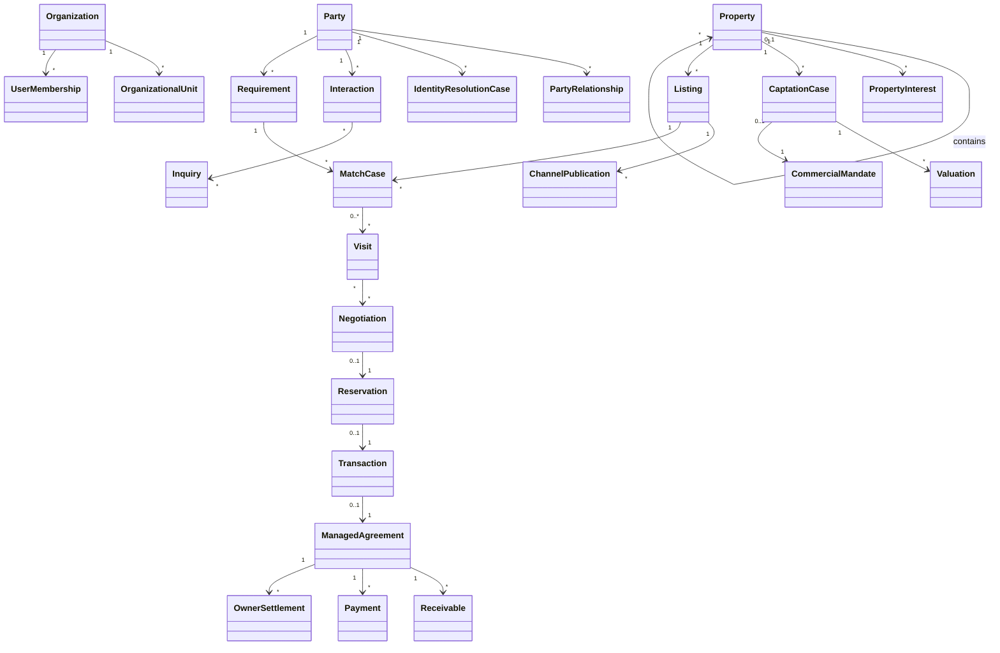

El diagrama es deliberadamente conceptual: no expresa ownership de base de datos ni significa que las relaciones sean foreign keys.

---

# 50\. Decisiones arquitectónicas ya cerradas por este modelo

1.  Mercado inicial argentino.
2.  Parties internacionales.
3.  MongoDB como persistencia principal inicial.
4.  Domain boundaries independientes de Mongo.
5.  Microservice-ready desde el diseño.
6.  No shared collections cross-context.
7.  No `Lead`.
8.  Party única + roles contextuales.
9.  Identity Resolution reactivo a alta/cambios identificatorios.
10. Property jerárquica y composable.
11. Rural first-class.
12. History de negocio selectiva.
13. Captation pipeline formal.
14. Valuation formal e histórica.
15. CommercialMandate formal.
16. Múltiples Listings simultáneos/históricos.
17. CommercialTerms expresivos.
18. Canonical Listing + channel overrides.
19. Omnicanalidad first-class.
20. App móvil first-class.
21. Requirement multi-intent por Party.
22. REQUIRED/PREFERRED/INDIFFERENT + confidence/provenance.
23. Matching automático explicable.
24. Feedback de descarte.
25. Visit formal + audio/notas.
26. Negotiation formal.
27. Reservation formal.
28. Transaction end-to-end.
29. Document management transversal.
30. Argentina packs.
31. Commission policies versionadas.
32. Automatizaciones orientadas a eventos.
33. IA con autonomía gradual.
34. Workflows opinionated + extensibles.
35. Google/Outlook mediante adapters.
36. Recordatorios multicanal.
37. Checklists + approvals.
38. Firma digital no core.
39. Rental Administration sí; contabilidad general no.
40. Maintenance optional.
41. Owner/Tenant portal optional.
42. Campañas masivas fuera de scope inicial.
43. Analytics core.
44. Management Copilot.
45. Core opinionated + capabilities + overrides controlados.

---

# 51\. Próxima iteración recomendada

El siguiente documento debería transformar este domain model en:

## A. Context Contracts

Por bounded context:

- commands públicos;
- queries;
- integration events;
- schemas;
- SLA;
- ownership.

## B. Arquitectura lógica

```text
Web
Mobile
BFF/API Gateway
Microservices
Event Bus
MongoDB
Redis/cache
Search
Object Storage
AI Gateway
Observability
```

## C. Arquitectura de datos

- databases/collections;
- índices;
- shard candidates;
- read models;
- cache invalidation;
- outbox/inbox;
- retention.

## D. Critical journeys

Diseñar sequence diagrams detallados para:

1.  inbound WhatsApp → Requirement;
2.  Identity Resolution;
3.  captación → Listing;
4.  Listing → Match;
5.  Visit → Negotiation;
6.  Reservation → Closing;
7.  locación → administración;
8.  AI handoff → humano;
9.  portfolio reassignment;
10. compliance/document workflow.

## E. NFRs

- multi-tenancy;
- performance;
- availability;
- audit;
- observability;
- encryption;
- data residency;
- backup;
- recovery;
- privacy;
- rate limits;
- cost.

---

# 52\. Conclusión

El corazón del producto no es “guardar propiedades y clientes”.

Es mantener un **grafo operativo de relaciones comerciales inmobiliarias**:

```text
Parties
    interactúan
        ↓
expresan intenciones
        ↓
Requirements / CaptationCases
        ↓
se cruzan con Properties / Listings
        ↓
Matches
        ↓
Visits
        ↓
Negotiations
        ↓
Reservations
        ↓
Transactions
        ↓
Administration / recurrencia
```

al mismo tiempo que:

```text
Channels -> capturan realidad
AI -> reduce carga manual
Automation -> evita enfriamiento
Packs -> evitan setup complejo
Analytics -> explican desempeño
Authorization -> preserva scopes
Documents/Compliance -> preservan evidencia
```

La UX puede ser extremadamente simple precisamente porque **la complejidad está bien modelada debajo**.

El objetivo final del dominio es que el agente inmobiliario no “administre un CRM”.

El agente debe:

> hablar con gente, visitar propiedades, negociar y cerrar.

El sistema debe encargarse de capturar, ordenar, recordar, cruzar, explicar y automatizar el resto.
