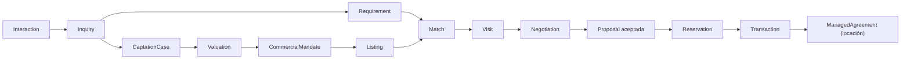

# Modelo de Dominio — Versión resumida

> **Resumen operativo de [`../README.md`](../README.md) (5.559 líneas).**
> Sirve para entender el dominio completo y tomar decisiones cotidianas.
> **No es fuente de verdad:** ante cualquier contradicción gana el README.
> Cuando necesites el detalle de un contexto puntual, la tabla final indica qué sección leer.

---

## 1. En una página

CRM inmobiliario argentino, multi-tenant, diseñado como **bounded contexts desacoplados** listos para desplegarse como microservicios sin rediseñar el dominio.

**North Star:** operaciones cerradas por agente activo.
**Guardrail:** esfuerzo administrativo por operación cerrada. Cerrar más, no trabajar más.

El producto no es "guardar propiedades y clientes". Es mantener un **grafo operativo**:

```text
Parties → interactúan → expresan intenciones
  → Requirements (demanda) / CaptationCases (oferta)
  → se cruzan con Properties / Listings
  → Matches → Visits → Negotiations → Reservations → Transactions
  → Administración de alquileres / recurrencia
```

Mientras tanto: los canales capturan la realidad, la IA reduce carga manual, la automatización evita que las cosas se enfríen, los packs evitan el setup complejo, analytics explica el desempeño y compliance preserva la evidencia.

---

## 2. Los seis principios que condicionan todo

1. **Simple by default, powerful by exception.** El usuario común no configura el modelo de dominio. Etapas, documentación argentina, estados, motivos de descarte y checklists vienen en **packs versionados**.
2. **Ubiquitous Language.** Las palabras del sistema son las del negocio. Nada de `status = WON` para tapar un proceso inmobiliario.
3. **Identidad ≠ rol ≠ contexto.** Una `Party` no tiene rol comercial permanente; los roles viven en el contexto (`Transaction`, `Requirement`, `PropertyInterest`, `Lease`).
4. **Estado actual + historia significativa + auditoría técnica.** Tres capas separadas. **No** hay Event Sourcing global.
5. **Sin persistencia compartida entre contextos.** Un contexto puede conocer el ID público de otro aggregate; nunca leer su colección.
6. **El modelo rico define lo que se puede representar, no lo que el usuario está obligado a cargar.** Quick capture primero; bloquear solo cuando una invariante o norma realmente lo exige.

---

## 3. Vocabulario

**Existe:** `Party` · `Interaction` · `Inquiry` · `Requirement` · `CaptationCase` · `Property` · `Valuation` · `CommercialMandate` · `Listing` · `Match` · `Visit` · `Negotiation` · `Proposal` · `Reservation` · `Transaction` · `ManagedAgreement` · `Receivable` · `Payment` · `OwnerSettlement`

**Deliberadamente NO existe:**

| No modelamos | Por qué | Qué usamos |
|---|---|---|
| `Lead` | No hay lead permanente | `Interaction` + `Inquiry` |
| `Customer` | Ambiguo: hoy vende, mañana compra, pasado garantiza | `Party` + rol contextual |
| `Opportunity` | Contenedor genérico por costumbre | `Requirement`, `CaptationCase`, `Negotiation`, `Transaction` |
| `AI Agent` como Party/User | Es actor tecnológico | `AgentDecision` con provenance |
| `CustomField` sin schema | Rompe semántica y analytics | `ExtensionSchema` tipado y versionado |
| `Dashboard` / `Score` como entidad | Son derivados | Read models / scores por dominio |

---

## 4. Contextos y ownership

| Concepto | Bounded context owner |
|---|---|
| estructura organizacional, permisos | Organization & Access |
| identidad de Party | Party Registry |
| resolución de duplicados | Identity Resolution |
| inmueble físico, derechos sobre inmueble | Property Registry |
| captación, tasación, mandato | Captation & Valuation |
| oferta comercial | Listing |
| publicación en portales | Syndication |
| conversación / interacción | Interaction Hub |
| intención no resuelta | Inquiry |
| necesidad del cliente | Requirement |
| compatibilidad oferta/demanda | Matching |
| agenda | Scheduling |
| visita | Visits |
| negociación | Negotiation |
| reserva | Reservation |
| cierre | Transaction |
| documento, cumplimiento | Documents & Compliance |
| comisión | Commissions |
| contrato administrado, cobros | Rental Administration |
| mantenimiento | Maintenance (opcional) |
| automatización, IA | Automation & AI |
| métricas | Analytics (derivadas) |

> **Bounded context ≠ microservicio.** Son fronteras semánticas y de ownership. La agrupación física la define [`../ARCHITECTURE.md`](../ARCHITECTURE.md) §6.

---

## 5. Aggregates y estados por contexto

### Foundation

- **`Organization` / `OrganizationalUnit` / `Membership` / `RoleDefinition` / `PermissionGrant`** — jerarquía de unidades, memberships con vigencia, permisos = acción + recurso + **scope** (`OWN`, `TEAM`, `UNIT`, `UNIT_AND_DESCENDANTS`, `ORGANIZATION`, `CUSTOM`). Los `UserPermissionOverride` tienen motivo, aprobador y vencimiento. `PortfolioReassignment` migra cartera sin destruir historial.
  **`UserAccount` no es `Party`.**
- **`Party`** — `kind`: `NATURAL_PERSON` | `LEGAL_ENTITY` | `LEGAL_ARRANGEMENT` (fideicomisos, trusts). Estados: `PROVISIONAL` → `ACTIVE` / `ALIASED` / `INACTIVE` / `RESTRICTED`. Contiene contactPoints, addresses, taxIdentifiers, identityDocuments, provenance. **No** contiene requirements, interactions ni transactions.
- **`PartyRelationship`** — relaciones tipadas y con vigencia (`SPOUSE`, `LEGAL_REPRESENTATIVE`, `GUARANTOR`, `BENEFICIAL_OWNER`, `TRUSTEE`, `CO_PURCHASER`…), no arrays rígidos.
- **`IdentityResolutionCase`** — se dispara solo por alta o cambio de **atributos identificatorios**. Evidencia ponderada → score → `AUTO_RESOLVED` / `REVIEW_REQUIRED` / `CONFIRMED_DISTINCT`. Merge **no destructivo y reversible**; thresholds versionados.
- **`Document`** (versionado, con retention y confidentiality) · **`ComplianceCase`** · **`BeneficialOwnershipDeclaration`** · **`ConsentGrant`**. El binario nunca vive dentro de Party/Property.
- **`Capability` / `PackManifest` / `ExtensionSchema`** — packs argentinos versionados. Cada caso operacional fija su `appliedPackVersion`; una operación histórica **nunca** se reinterpreta con una versión nueva.

### Supply / oferta

- **`Property`** — inmueble físico, independiente de que se comercialice. Jerárquica vía `parentPropertyId` (desarrollo → torre → unidad; campo → fracción/casco/silos). Atributos rurales first-class (ha, aptitud, agua, mejoras, accesos).
- **`PropertyInterest`** — titularidad como **derechos con vigencia** (`rightType`, participación, legalBasis, documentos), no `ownerIds[]`.
- **`CaptationCase`** — `IDENTIFIED` → `CONTACTING` → `ENGAGED` → `VALUATION_PENDING` → `VALUATED` → `MANDATE_NEGOTIATION` → `CAPTURED` / `LOST` / `DORMANT`. La prioridad es una **proyección explicable** (score + drivers + modelVersion), no un campo manual.
- **`Valuation`** — formal, histórica, inmutable una vez emitida; corregir produce nueva versión. Soporta total, por m², por hectárea, rango y moneda.
- **`CommercialMandate`** — `DRAFT` / `ACTIVE` / `EXPIRED` / `REVOKED` / `SUPERSEDED`, con exclusividad y vigencia propias.
- **`Listing`** — la oferta comercial. `DRAFT` / `READY` / `ACTIVE` / `PAUSED` / `CLOSED` / `WITHDRAWN` / `EXPIRED`. `CommercialTerms` soporta dinero, permuta, porcentaje, participación en producción, bienes y formas mixtas; con financiación, cuotas e indexación.
- **`ChannelPublication`** — solo **overrides** sobre el listing canónico. No se duplica el listing por portal.

### Demand / demanda

- **`Conversation` / `Interaction`** — omnicanal (WhatsApp, email, IG/FB, portales, teléfono, app, formulario, carga manual). `InteractionLink` vincula una interacción a cualquier caso comercial con `confidence` y `reason`.
  **Regla:** *Interaction siempre; Inquiry solo cuando hay una intención que requiere clasificación.*
- **`Inquiry`** — intención no resuelta. `NEW` → `CLASSIFYING` → `QUALIFIED` / `REVIEW_REQUIRED` / `NON_COMMERCIAL` / `DUPLICATE_INTENT` / `CLOSED`. Se resuelve creando o vinculando un `Requirement` o un `CaptationCase`.
- **`Requirement`** — qué busca una Party. Una Party puede tener **N activos**. Cada `RequirementCriterion` lleva:
  - `importance` = `REQUIRED` | `PREFERRED` | `INDIFFERENT` → cuánto le importa al cliente
  - `confidence` → cuán seguros estamos de haber entendido
  - `provenance` → interacción fuente, quién/qué lo extrajo, confirmaciones

  **Son dimensiones distintas. No mezclarlas.**

### Ejecución comercial

- **`MatchCase`** — evaluación versionada con `eligibility` (`ELIGIBLE` / `SOFT_MATCH` / `INELIGIBLE` / `NEEDS_REVIEW`), score **explicable** (qué obligatorios cumple, qué preferencias, desvío de presupuesto) y `MatchFeedback` con reasonCode. Un `REQUIRED` confirmado no se compensa con preferencias.
- **`ScheduleItem`** — agenda propia; Google/Outlook entran por `externalCalendarBindings`, sin lógica de proveedor en el dominio.
- **`Visit`** — `SCHEDULED` → `CONFIRMED` → `IN_PROGRESS` → `COMPLETED` / `NO_SHOW` / `CANCELLED` / `RESCHEDULED`. Multi-party y multi-agente. Notas con visibilidad; grabación solo con consentimiento aplicable.
- **`Negotiation` + `Proposal`** — no se separan Offer y CounterOffer. Una `Proposal` emitida es **inmutable**: se supersede con otra. Toda aceptación señala exactamente qué proposal se acepta. El perfil de negociación es un read model objetivo, nunca una etiqueta subjetiva.
- **`Reservation`** — seña/reserva, distinta de la propuesta aceptada y de la Transaction. `DRAFT` / `PROPOSED` / `CONFIRMED` / `EXPIRED` / `CANCELLED` / `FULFILLED`.
- **`Transaction`** — cierre end-to-end. Estados semánticos: `PREPARING` / `DUE_DILIGENCE` / `READY_TO_CLOSE` / `CLOSED` / `CANCELLED` / `FAILED`. Instancia un snapshot versionado de `WorkflowTemplate` con tasks, requisitos documentales, aprobaciones y SLAs. Saltear una tarea requiere `ExceptionRequest` con permiso y aprobador; una tarea compliance-critical puede no admitir bypass.
- **`CommissionPolicy` / `CommissionCalculation`** — policies versionadas con scope y precedencia explícita; splits por rol (captador, demanda, sucursal, referido…).

### Post-transacción

- **`ManagedAgreement`** — `URBAN_LEASE`, `COMMERCIAL_LEASE`, `TEMPORARY_LEASE`, `RURAL_LEASE`, `SHARECROPPING`. La contraprestación puede ser dinero fijo, indexado, por hectárea, porcentaje, frutos o combinación.
- **`Schedule` → `Receivable` → `Payment` → `PaymentAllocation` → `OwnerSettlement`**, más `Expense` y `ArrearsCase`. Un pago puede ser parcial o cubrir varias deudas: **`Payment` ≠ `Receivable`**.
- `AdjustmentRule` no hardcodea ICL ni IPC.
- **Ledger operativo, no contabilidad general.** Sin balances, plan de cuentas ni DDJJ.

---

## 6. Flujo comercial completo



No todos los casos recorren todos los pasos; el workflow pack define las variantes.

---

## 7. Reglas de oro

Las 40 invariantes globales del README §23, agrupadas por lo que más muerde al implementar:

**Identidad**

1. Una `Party` puede tener N roles simultáneos sin duplicarse; los roles no contaminan la identidad base.
2. Un `UserAccount` no es una `Party`. Identidad y autorización son dominios distintos.
3. Identity Resolution se dispara solo con datos identificatorios; todo merge es auditable y reversible.
4. Una Party nunca se elimina destructivamente por una unificación.

**Oferta**

5. `Property != Listing`, con lifecycles independientes. Cerrar un listing no cierra la Property.
6. Una Property puede tener cero, uno o varios listings simultáneos o históricos (p. ej. alquilada y en venta a la vez).
7. Titularidad no es `ownerId`: se modelan intereses/derechos con vigencia.
8. Una `Valuation` histórica no se sobrescribe.
9. Una `CaptationCase` no es un `Listing`; un mandato tiene vigencia y alcance propios.

**Demanda**

10. Una interacción no obliga a crear una Inquiry; una Inquiry calificada se resuelve o se cierra.
11. `importance` y `confidence` son conceptos distintos; todo criterio inferido conserva provenance.
12. El match score debe ser explicable y versionado; el feedback de descarte es información de dominio.

**Cierre**

13. Una `Proposal` emitida es inmutable.
14. `Reservation` ≠ propuesta aceptada ≠ `Transaction`.
15. Toda etapa personalizada mapea a un **estado semántico** estándar, o se rompe analytics.
16. Saltear una tarea relevante requiere policy, permiso y aprobación.
17. Cerrar una venta no borra contratos previos ni historial.

**Transversal**

18. Ningún bounded context lee colecciones privadas de otro.
19. Todo integration event es versionado e idempotente.
20. Los packs aplicados a una operación quedan fijados por versión.
21. La IA no accede a Mongo directamente y opera con scope delegado.
22. Analytics no es fuente de verdad; toda métrica importante tiene lineage.

---

## 8. Reglas MongoDB

- **Una colección por raíz de agregado.** La unidad de consistencia del dominio guía el documento.
- **Embeber** cuando el lifecycle está subordinado al root, la cardinalidad es acotada, se actualiza atómicamente y no necesita query global. Ej.: `RequirementCriterion[]`, `CommercialTerms`, `ValuationValue[]`.
- **Referenciar** cuando crece sin límite, tiene lifecycle propio, necesita búsqueda o concurrencia independiente, o pertenece a otro contexto. Ej.: interactions, documents, property children, payments, listings, visits.
- **Nunca documentos gigantes.** Un edificio o un campo no se embeben: cada `Property` es aggregate independiente que referencia a su parent.
- **`tenantId`/`organizationId` en todo documento tenant-owned**; índices únicos tenant-aware.
- **Optimistic concurrency:** `version` en el aggregate, `expectedVersion` en el command.
- **Outbox** en el mismo boundary transaccional que la escritura de negocio; **Inbox** para idempotencia del consumer. Change Streams puede ser transporte/CDC, nunca el evento de negocio.

---

## 9. Eventos

Envelope obligatorio de todo integration event:

```text
eventId · eventType · eventVersion · tenantId
aggregateType · aggregateId · aggregateVersion · occurredAt
actor { type, id }        # HUMAN_USER | EXTERNAL_PARTY | AI_AGENT | SYSTEM | INTEGRATION
correlationId · causationId · source · payload
```

Reglas: evento publicado es inmutable; schema versionado; consumer idempotente; `correlationId` atraviesa contextos; payload mínimo sin PII innecesaria; los eventos internos pueden ser más ricos que el contrato público.

**Eventos ancla por journey:** `PartyRegistered` · `CaptationCaseOpened` · `ValuationIssued` · `CommercialMandateGranted` · `ListingActivated` · `InteractionReceived` · `RequirementCreated` · `MatchCalculated` · `VisitCompleted` · `ProposalAccepted` · `ReservationConfirmed` · `TransactionClosed` · `ManagedAgreementCreated` · `PaymentReceived` · `OwnerSettlementFinalized`

---

## 10. Read models

Derivados y reconstruibles, nunca fuente de verdad ni receptores de comandos de negocio:

`Party360` · `Property360` · `AgentToday` · `ManagerCockpit` · `ListingPerformance` · métricas de alquileres · vistas del copiloto.

La UI no compone 15 APIs para pintar una pantalla. Toda métrica declara `MetricDefinition` (fórmula versionada, eventos fuente, dimensiones, exclusiones) y toda observación conserva lineage. **No metric without lineage.**

---

## 11. Scoring: nunca un score universal

| Score | Pregunta que responde |
|---|---|
| `IdentityMatchScore` | ¿Es la misma Party? |
| `CaptationPriorityScore` | ¿Dónde conviene invertir tiempo para captar oferta? |
| `MatchScore` | ¿Cuánto encaja este Listing con este Requirement? |
| `CommercializationScore` | ¿Qué tan colocable parece este Listing? |
| `InteractionIntentConfidence` | ¿Entendimos bien la intención? |
| `AIActionConfidence` | ¿Qué tan segura es una acción automatizada? |

Todos llevan `score`, `version`, `inputs`, `drivers/evidence`, `calculatedAt`. No mezclar semánticas porque todos sean un número entre 0 y 100.

---

## 12. Rural como dominio first-class

Tratar el campo como "un terreno grande" es un error de producto. El dominio contempla hectáreas y fracciones, aptitud y suelo, agua e infraestructura, accesos, mejoras y producción; economía por hectárea, pagos mixtos, arrendamiento y participación en frutos (aparcería/mediería, Ley 13.246); jerarquía establecimiento → fracciones/casco/galpones/silos/corrales; y analytics de precio/ha, absorción por zona y demanda por aptitud.

---

## 13. IA y automatización

**Regla dura:** ningún LLM/subagente consulta MongoDB directamente. Usa domain APIs, query services, read models autorizados, commands y tools explícitas, siempre dentro del scope del usuario que originó la acción. Un subagente nunca obtiene más permisos que el contexto delegado.

Autonomía **por capability y por acción**, no un `AI enabled = true`:

```text
SUGGEST_ONLY · REQUIRE_APPROVAL · AUTO_EXECUTE_WITH_GUARDRAILS · AUTO_EXECUTE
```

Extraer una preferencia → guardrails. Cambiar un `REQUIRED` → aprobación. Omitir un requisito de compliance → nunca. Toda `AgentDecision` guarda modelo, versión, evidencia, confidence, acción y resultado (no chain-of-thought). Los mensajes externos que envía la automatización vuelven al sistema como `Interaction`.

---

## 14. Calidad del dato

Distinguir de `null` cuando la semántica lo justifique: `UNKNOWN` · `NOT_APPLICABLE` · `DECLINED_TO_PROVIDE` · `NOT_YET_VERIFIED`. **`UNKNOWN` nunca se convierte en `false` ni en `0`**, especialmente en métricas y denominadores.

Provenance de todo dato relevante: `sourceType` (HUMAN_ENTRY, CLIENT_MESSAGE, PHONE_TRANSCRIPT, VISIT_TRANSCRIPT, PORTAL, IMPORT, DOCUMENT_EXTRACTION, AI_INFERENCE, SYSTEM_CALCULATION, EXTERNAL_API), `sourceId`, `capturedAt`, `capturedBy`, `confidence?`, `confirmedBy?`.

---

## 15. Prioridad conceptual

- **Tier A — núcleo comercial:** Organization & Access · Party · Identity Resolution · Property · Captation & Valuation · Listing · Interaction Hub · Inquiry & Requirement · Matching · Visits · Negotiation · Reservation & Transaction
- **Tier B — operabilidad indispensable:** Documents & Compliance · Scheduling · Notifications · Commissions · Automation · Analytics
- **Tier C — expansión de alto valor:** Rental Administration · AI Orchestration avanzada · Syndication multiportal · Management Copilot
- **Tier D — capabilities adicionales:** Maintenance · Owner Portal · Tenant Portal · Telefonía · canal marketplace propio

No es roadmap temporal. El roadmap ejecutable es [`tasks/TASK_BOARD.md`](tasks/TASK_BOARD.md).

---

## 16. Riesgos de diseño a evitar

Party gigante · Property gigante (embeber un edificio) · acoplamiento por base compartida · microservicio por entidad · workflow genérico demasiado pronto · IA sin provenance · over-automation inicial · métricas irreproducibles · estados custom sin mapeo semántico · rural tratado como `LAND`.

---

## 17. Marco normativo considerado

| Norma | Impacto de diseño |
|---|---|
| **Res. UIF 43/2024** | Party humana/jurídica/estructura, nacional o extranjera; beneficiario final representable; evidencia y versión de reglas conservadas; retención documental; reconstrucción de operaciones individuales con monto y moneda |
| **Ley 13.246** (arrendamientos y aparcerías rurales) | Modalidades rurales distintas de la locación urbana; contraprestación no limitada a dinero |
| **CCyC — locación** | El `ManagedAgreement` tiene lifecycle propio; enajenar una Property no elimina automáticamente la locación |
| **Ley 25.326** (datos personales) | Consentimiento, finalidad, confidencialidad, trazabilidad; grabaciones y transcripciones; políticas de retención |

Los packs normativos requieren validación de Legal/Compliance antes de usarse como automatización regulatoria. Esto es diseño de software, no asesoramiento legal.

---

## 18. Dónde ampliar

| Necesitás detalle de… | Leé en [`../README.md`](../README.md) |
|---|---|
| Principios y lenguaje ubicuo | §1 |
| Alcance, tipos de operación, módulos | §2 |
| Context map completo | §3 |
| Organización, roles, permisos, overrides | §4.1 |
| Party: perfiles, VOs, relaciones | §4.2 |
| Identity Resolution: evidencia, scoring, thresholds | §4.3 |
| Documentos, compliance, consentimiento | §4.4 |
| Capabilities y packs | §4.5 |
| Property: jerarquía, rural, intereses, registral | §5.1 |
| Captación, tasación, mandato | §5.2 |
| Listing y CommercialTerms | §5.3 |
| Syndication y portales | §5.4 |
| Interacciones, telefonía, app móvil | §6.1 |
| Inquiry | §6.2 |
| Requirement y criterios | §6.3 |
| Matching, explainability, feedback | §7 |
| Scheduling y Visits | §8 |
| Negotiation y Proposals | §9 |
| Reservation y Transaction, workflows, excepciones | §10 |
| Comisiones e incentivos | §11 |
| Administración de alquileres | §12 |
| Maintenance | §13 |
| Automation e IA | §14 |
| Notificaciones | §15 |
| Analytics y Management Copilot | §16 |
| Portales owner/tenant | §17 |
| Flujos end-to-end con diagramas | §18 |
| Envelope y reglas de eventos | §19 |
| Implicancias MongoDB | §20 |
| Autorización transversal / ExecutionContext | §21 |
| Tabla completa de ownership | §22 |
| Las 40 invariantes globales | §23 |
| Estados custom vs semánticos | §24 |
| Scoring domains | §25 |
| Rural first-class | §26 |
| Workbench de agente / manager | §27, §28 |
| Responsabilidad humana vs IA, handoff | §29 |
| Pseudo-documentos Mongo | §30 |
| Eventos por journey | §31 |
| Commands candidatos | §32 |
| Read models | §33 |
| Consistencia cross-context | §34 |
| Idempotencia | §35 |
| Provenance y calidad de dato | §36, §37 |
| Search y caché | §38, §39 |
| Lo que no se modela | §40 |
| North Star y drivers | §41 |
| Setup plug-and-play | §42 |
| Riesgos de diseño | §43 |
| Tiers y microservice-readiness | §44, §45, §46 |
| Investigación y normativa | §47, §48 |
| Decisiones ya cerradas | §50 |

**Documentos hermanos:** [`../ARCHITECTURE.md`](../ARCHITECTURE.md) (arquitectura y trazabilidad) · [`implementation/POC_TECH_DECISIONS.md`](implementation/POC_TECH_DECISIONS.md) (stack POC) · [`tasks/TASK_BOARD.md`](tasks/TASK_BOARD.md) (92 tasks / 274 UCs).
